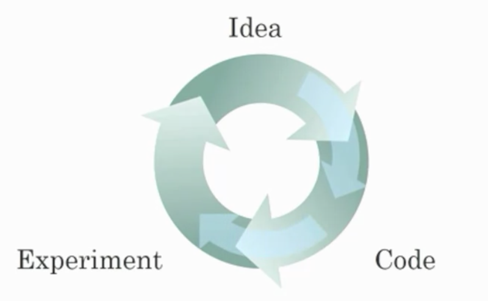

1. What does the analogy “AI is the new electricity” refer to?

   1. it will bring transformation in all industries

2. Why deep learning recently taking off?

   1. Increasing amount of labeled data
   2. DL has result in significant improvements in important applications
   3. More computational power
   4. Algorithms: most of them are created to speed the training process. For example sigmoid function can be slow in zones where y is almost 0 or almost 1(small gradiant -> small change), by using ReLu it will speed up

3. Recall this diagram of iterating over different ML ideas. Which of the statements below are true? (Check all that apply.)

   

   1. Being able to try out ideas quickly allows deep learning engineers to iterate more quickly.
   2. Faster computation can help speed up how long a team takes to iterate to a good idea.
   3. Recent progress in deep learning algorithms has allowed us to train good models faster (even without changing the CPU/GPU hardware).

4. When an experienced deep learning engineer works on a new problem, they can usually use insight from previous problems to train a good model on the first try, without needing to iterate multiple times through different models. True/False?

   1. False, Fiding the characteristic of a model is key to have good performance, so it require multiple iterations to build a good model

5. Structured data vs unstructured

   1. Structured data: each of the features have defined meaning (like age, width, etc)

      Unstructured data: audios, images, text

6. RNN: 

   1. it can be trained as supervised learning
   2. It is applicable when the input/output is sequential