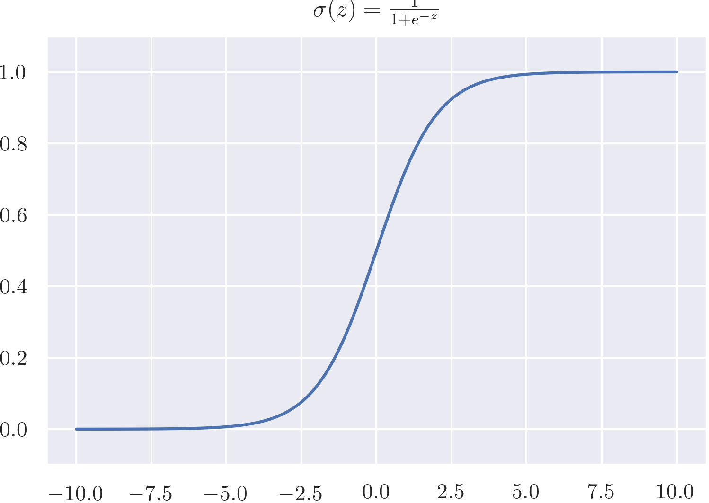
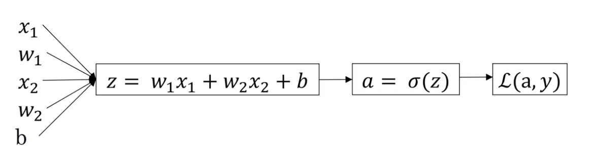

# Logistic regresssion

We have a binary classification problem, we can use logistic regression. In a simple case, given input X and output Y, the relationship between X and Y can be linear, defined as  $\hat{y} = w^TX+b$ . In addition, we can use an activation function sigma to convert the linear regression problem to a binary classification problem, which is called logistic regression, defined as 
$$
\hat{y} = \sigma(w^TX+b)
$$
where sigma is the sigmoid function that is represented by the 

In each iteration when the output is estimated, we want to evaluate how it is close to the true value x, so we define the loss function. 

## Loss function

The simplest loss function can be defined as the mean square error: $L(\hat{y}, y)=\frac{1}{2}(\hat{y}-y)^{2}$, but it make the gradient descent don't work. 

For this case the loss function is defined as
$$
L(\hat{y}, y) = -(y*\log(\hat{y}) + (1-y)*\log(1-\hat{y}))
$$
When y=1 (we expect $\hat{y}$=1), the loss function will be $L(\hat{y}, y) = -y*\log(\hat{y})$, in this case, we want the error be minimum, so we want $\hat{y}$ be as large as possible. 

In the contrary case, y=0, $L(\hat{y}, y) = -\log(1-\hat{y})$, in this case, so we want $\hat{y}$ be as small as possible. 

The loss function measures the performance of a single example. To measure the performance of the entire training set, we use **cost function**, which is the average of the loss function. The cost function J is defined as:
$$
J(w, b)=\frac{1}{m} \sum_{i=1}^{m} L\left(y^{(j)}, y^{(i)}\right)
$$

## Gradient descend

When we train a model the error must be minimum -> **find w and b that minimize $J(w,b)$**

To calculate the best w and b: we initialize w and b, then repeatedly update w and b until find the global minimum. At each step:
$$
w := w - \alpha \frac{\partial J}{\partial w}= w-\alpha dw \\
b := b - \alpha \frac{\partial J}{\partial w}= w-\alpha db \\
$$

where $\alpha$ is the learning rate and $\frac{\partial J}{\partial w}$ is the gradient. When $\frac{\partial J}{\partial w}<0$, the gradient descends, otherwise the gradient ascends.

## Computational graph

Computational graph can be used to calculate the **back propagation**: **derivate of the cost function**: from $L(a,y)$ compute $w,b$

In this case: 
$$
\begin{array}{ccc}
		z & = & w_1 x_1 + w_2 x_2 +b \\
		a & = & \sigma(z)=\frac{1}{1+e^-z}\\
		L(a,y) & = & -(y*\log(a) + (1-y)*\log(1-a))
	\end{array}
$$
We can compute the partial derivative as :
$$
\begin{array}{cclcl}
	\frac{\partial a }{\partial z} & = & \frac{e^{-z}}{(1+e^{-z})^2} = \frac{-1}{1+e^{-z}} +  \frac{1}{(1+e^{-z})^2} = a(a-1) & = & da \\
	\frac{\partial{L}}{\partial a} & = & -\frac{y}{a} + \frac{1-y}{1-a}\\
	\frac{\partial L}{\partial z}  & = & \frac{\partial{L}}{\partial a} * \frac{\partial a}{\partial z} = a-y & = & dz\\
	\frac{\partial L}{\partial w_1}  & = & \frac{\partial{L}}{\partial z} * \frac{\partial z}{\partial w_1} =dz*x_1& = & dw_1 \\
	\frac{\partial L}{\partial w_2}  & = & \frac{\partial{L}}{\partial z} * \frac{\partial z}{\partial w_2} =dz*x_2& = & dw_2 \\
	\frac{\partial L}{\partial b}  & = & \frac{\partial{L}}{\partial z} * \frac{\partial z}{\partial b}  =dz *1& = &db \\
	\end{array}
$$
With the partial derivative we can compute the gradient descend.

## Vectorization

Nowadat vectorization is importtant because with the great amount of data is important to **reduce the excecution time**.  The prebious equation can be reworte as:

- Forward propagation
  $$
  	\begin{array}{ccc}
  		Z & =&w^TX+b=np.dot(w^T,x)+b \\
  		A &= & \sigma(Z)
  		
  	\end{array}
  $$
  
- Backward propagation
  $$
  \begin{array}{ccc}
  		dZ	& = & A-Y \\
  		dw  & = & \frac{1}{m}XdZ^T \\
  		db 	& = & \frac{1}{m}dZ  \\
  	\end{array}
  $$
  

Then, we can update w and b for gradient descend as:
$$
	\begin{array}{ccc}
		w: & = & w-\alpha dw \\
		b: & = & b-\alpha dw
	\end{array}
$$

# Python broadcasting

| Rules                                                        | A     | B     | A'    | B'    |
| ------------------------------------------------------------ | ----- | ----- | ----- | ----- |
| If the two arrays differ in their number of dimensions, the shape of the one with fewer dimensions is padded with ones on its leading (left) side | (3,1) | (3)   | -     | (1,3) |
| If the shape of the two arrays does not match in any dimension, the array with shape equal to 1 in that dimension is stretched to match the other shape. | (3,1) | (1,3) | (3,3) | (3,3) |
| If in any dimension the sizes disagree and neither is equal to 1, an error is raised. |       |       |       |       |

---

Important questions

1. What does a neuron compute

   A neuron computes a linear function (z = Wx + b) followed by an activation function

2. Logistic loss:
   $$
   L(\hat{y}, y) = -(y*\log(\hat{y}) + (1-y)*\log(1-\hat{y}))
   $$
   
3. Broadcasting

---

# Building logistic regression model

Given an datasetset:

- train_X.shape = ($num\_pixel*num\_pixel*3$,m_train)
- train_Y.shape = (1,m_train)
- test_X.shape = ($num\_pixel*num\_pixel*3$,m_test)
- test_Y.shape = (1,m_test)

**Mathematical expression of the algorithm**
$$
z^{(i)} = w^T x^{(i)} + b \tag{1}
$$

$$
\hat{y}^{(i)} = a^{(i)} = sigmoid(z^{(i)}) \tag{2}
$$

$$
\mathcal{L}(a^{(i)}, y^{(i)}) =  - y^{(i)}  \log(a^{(i)}) - (1-y^{(i)} )  \log(1-a^{(i)})\tag{3}
$$

The cost is then computed by summing over all training examples:
$$
J = \frac{1}{m} \sum_{i=1}^m \mathcal{L}(a^{(i)}, y^{(i)})\tag{4}
$$
**Key steps**

1. Initialize parameters w and b. 
   - As it is represented in the picture, w is an array with shape = (m_train,1)
   - b is a scalar
2. Learn the parameters fot the model by minimizing the cost. Given w, b X and Y, we have to compute:
   - Current loss (forward propagation)
     - $A = \sigma(w^T X + b) = (a^{(1)}, a^{(2)}, ..., a^{(m-1)}, a^{(m)})$. A.shape=(1, m_train)
     - Cost function: $J = -\frac{1}{m}\sum_{i=1}^{m}y^{(i)}\log(a^{(i)})+(1-y^{(i)})\log(1-a^{(i)})$. J is a scalar.
   - Current gadient (backward propagation)
     - $dw = \frac{\partial J}{\partial w} = \frac{1}{m}X(A-Y)^T$
     - $db=\frac{\partial J}{\partial b} = \frac{1}{m} \sum_{i=1}^m (a^{(i)}-y^{(i)})$
   - Update parameters (gradient descent)
     - w = w - learning_rate * dw
     - b = b - learning_rate * db

3. Use the learned parameters to make predictions ( on the test set)
   - The prediction $\hat{Y} = A = \sigma(w^T X + b)$
   - Then convert into 0 if activation <=0.5, else 1

4. analyse the result and conclude: train accuracy and test accuracy
   - Training accuracy is usually higher than test accuracy (overfit)
   - Learning rage $\alpha$ determines how rapidly we update the parameters. If the learning rate is too large we may "overshoot" the optimal value. Similarly, if it is too small we will need too many iterations to converge to the best values. 
     - Choose the learning rate that better minimizes the cost function.
     - If your model overfits, use other techniques to reduce overfitting.  