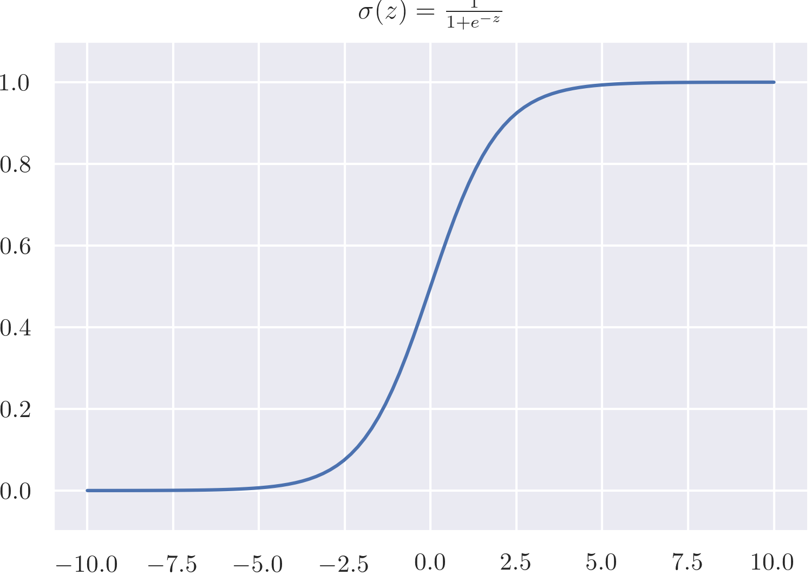

[TOC]

# Neural network representation


In a shallow neural network, there are:

- An input layer X, also denoted as $a^{[0]}$
- A hidden layer(Is hidden because during the training process the value of these layer are hidden, even you can extract it explicitly), denoted $a^{[1]}$
- Output layer, denoted $a^{[2]}$

The hidden layer and the output layer has parameter asociated to them, w and b.

## Computing a Neural Network's output

Just like logistic regression, we compute the forward and backward propagation, but repeating as many as number of hidden nodes, in this case 4. We can vectorize it. 


Given input X with shape [n_x, m]
$$
X = \begin{bmatrix}
| & | & | &|\\
x^{(1)}& x^{(2)} &\cdots & x^{(m)}\\
| & | & | &|
\end{bmatrix}
$$
and A 
$$
A^{[1]} = \begin{bmatrix}
| & | & | &|\\
a^{[1](1)}& a^{[1](2)} &\cdots & a^{[1](m)}\\
| & | & | &|
\end{bmatrix}
$$
We can compute the output as:
$$
z^{[1] (i)} =  W^{[1]} x^{(i)} + b^{[1]} \tag{1}
$$

$$
A^{[1]} = \sigma(z^{[1]}) \tag{2}
$$

$$
Z^{[2]} = W^{[2]} A^{[1]} + b^{[2]} \tag{3}
$$

$$
\hat{y}^{(i)} = a^{[2]} = \sigma(Z^{ [2]})\tag{4}
$$

When it is vectorized, the vertical index represents hidden unit and horizontal index represents the training sample (for Z and A).


For example, if X has 3 training examples, each exmaple with 2 values.

| Parameters | Sahape                |                                                              |
| ---------- | --------------------- | ------------------------------------------------------------ |
| X          | [n_x, m],    [2, 3]   | X is a matrix which each column is an training example       |
| W1         | [n_h, n_x], [4, 2]    | the dimension of W is defined by the number of hidden unit (n_h) in the first layer and the input size n_x |
| b1         | [n_h, 1],     [4, 1]  |                                                              |
| Z1         | [n_h, m],    [4, 3]   | $z^{[1] (i)} =  W^{[1]} x^{(i)} + b^{[1]}$                   |
| A1         | [n_h, m],    [4 ,3]   | $A^{[1]} = \sigma(z^{[1]})$, so it will has the same shape as Z1 |
| W2         | [n_y, n_h],  [1, 4]   | the dimension of W2 is defined by the output unit n_y and the number of hidden unit n_h |
| b2         | [n_y, 1],      [1, 1] |                                                              |
| Z2         | [n_y, m],    [1, 3]   | $Z^{[2]} = W^{[2]} A^{[1]} + b^{[2]}$                        |
| A2         | [n_y, m],    [1, 3]   | $\hat{y}^{(i)} = a^{[2]} = \sigma(Z^{ [2]})$                 |


# Activation function

- Sigmoid

  

  - $a = \frac{1}{1+e^{-z}}$
  - Range a: [0,1]
  - Used for binary classification (because the output is between 0 or 1)

  

- Tanh 

  - $a = tanh(z) = \frac{e^z-e^{-z}}{e^z+e^{-z}}$
  - Range: a [-1,1]
  - Almost always work better than sigmoid because the value between -1 and 1, the activation is close to have mean 0 (The effect is similar to centering yhe data)
  - If z is very lare or z is very small, the slope of the gradient is almost 0, so this can slow down gradient descent.

- ReLu

  - $a = max(0,z)$
  - Derivative is almost 0 when z is negative and 1 when z is positive
  - Due to the derivative property, it can be faster than tank

- Leacy ReLu

Rules of thumb:

- If output is 0,1 value (binary classification) ->sigmoid
- If dont know which to use: -> ReLu

## Why non linear activation function?

If we only use linear activation, no matter how many hidden layer there are, all its doing is just compute a linear combination of the input, so there are no hidden layer.

Linear activation is used for linear regression problem in machine learning

# Derivatives of activation function

- Sigmoid: $g(z) = \frac{1}{1+e^{-z}}$
  $$
  g'(z)=\frac{e^{-z}}{(1+e^{-z})^2} = \frac{1}{1+e^{-z}}(1-\frac{1}{1+e^{-z}}) = g(z)(1-g(z))
  $$
  
- Tanh: $g(z) = \frac{e^z-e^{-z}}{e^z+e^{-z}}$
  $$
  g'(z) =\frac{(e^z+e^{-z})*(e^z+e^{-z})-(e^z-e^{-z})*(e^z-e^{-z})}{(e^z+e^{-z})^2} = 1+g(z)^2
  $$
  
- ReLu: $g(z)=max(0,z)$
  $$
  g'(z) = \left\lbrace \begin{array}{ccc}
  					0 &if &z<0 \\
  					1 & if & z\ge 0 
  					\end{array}
  \right.
  $$

  - Technicaally g'(z) is not defined in z=0, but in practical it don't mind if it is 1.


# Random initialization

Why we have to initialize parameters?

If we initialize w to all 0, then when we compute backward propagation the derivative will be symmetric for those hidden units, so it loss the effect of putting a lot of hidden units.

However, b is not symetric, so it can be initialzed to 0

For example, we can initialize w and b as:

```python
W = np.random.rand((2,2))*0.01
b = np.random.rand((2,1))
```

In general W is initialized to small number. Initializing W to a large number wil affect the output, for example in sigmoid, when w is large, z is large, then we get into the flat part, resulting in the slow gradient descend.

# Implementing a NN

The general methodology to build a Neural Network is to:

1. Define the neural network structure ( # of input units,  # of hidden units, etc). 

2. Initialize the model's parameters

   ```python
   W1 = np.random.randn(n_h,n_x) * 0.01
   b1 = np.zeros((n_h,1))
   W2 = np.random.randn(n_y,n_h) * 0.01
   b2 = np.zeros((n_y,1))
   ```

3. Loop:

      1. Implement forward propagation

           ```python
           Z1 = np.dot(W1,X)+b1
           A1 = np.tanh(Z1)
           Z2 = np.dot(W2,A1)+b2
           A2 = sigmoid(Z2)
           ```

      2. Compute loss

           ```python
           logprobs = np.multiply(np.log(A2),Y)+np.multiply(np.log(1-A2), (1-Y))
           cost = -1/m*np.sum(logprobs)
           ```

      3. Implement backward propagation to get the gradient

           ```python
           dZ2 = A2-Y
           dW2 = 1/m*np.dot(dZ2,A1.T)
           db2 = 1/m*np.sum(dZ2, axis=1, keepdims=True)
           dZ1 = np.dot(W2.T, dZ2)*(1-np.power(A1, 2))
           dW1 = 1/m*np.dot(dZ1,X.T)
           db1 = 1/m*np.sum(dZ1, axis=1, keepdims=True)
           ```

      4. Update parameters (gradient descent)

           ```python
           W1 = W1 - learning_rate*dW1
           b1 = b1 - learning_rate*db1
           W2 = W2 - learning_rate*dW2
           b2 = b2 - learning_rate*db2
           ```

4. Predict

   ```python
   A2, cache = forward_propagation(X, parameters)
   predictions = (A2>0.5)
   ```

   