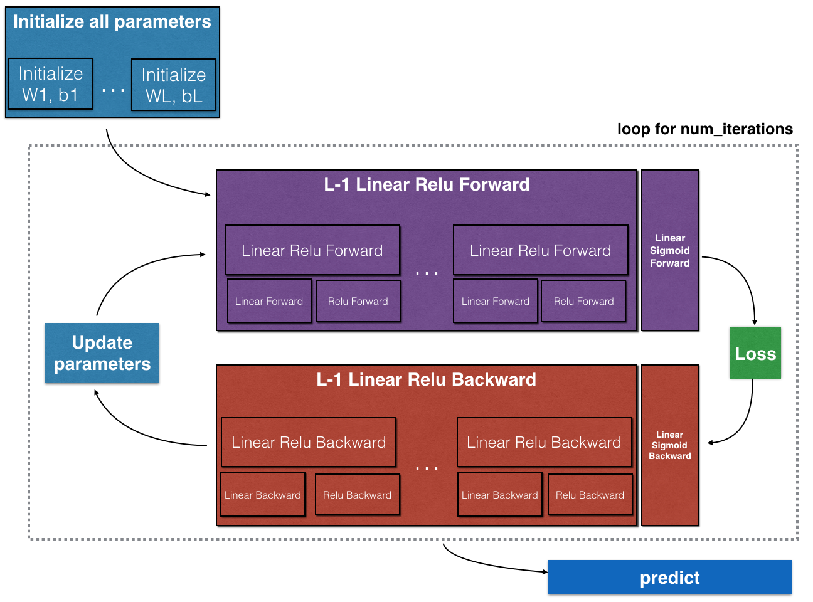
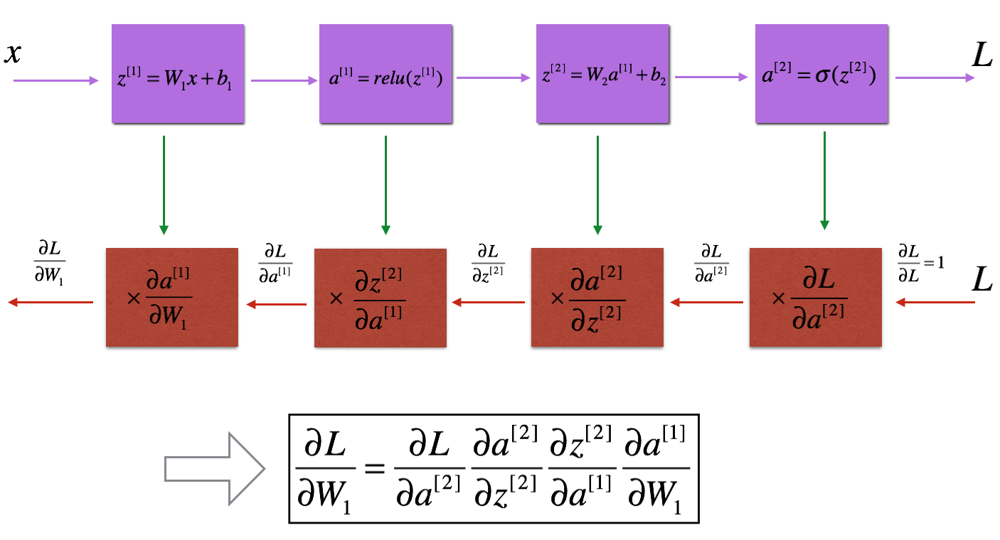

# Deep neural networks

**Why we need deep neural networks?**

The earlier layers of a network learns low level features whereas deeper layer learns more complicated features. In other words, with deeper neural network we can have a deeper knowledge of the input data.

**Notation**

- $X = a^{[0]}$: input
- L: number of layers, we dont count the input layer. From those layers, L-1 is hidden layer and 1 is output layer
- $\hat{y}=a^{[l]}$: output prediction
- We use superscript $[l]$ to denote quantity associated with the layer $l^{th}$ 
  - $a^{[l]}$: activation in layer l, $a^{[l]} = g^{[l]}(z^{[l]})$
  - $W^{[l]}$ and $b^{[l]}$ are $L^{th}$ layer parameters
  - $n^{[l]}$: number of units in layer $l$
- Superscript (i) denotes a quantity associated with the $i^{th}$ example
  - $x^{(i)}$ is the $i^{th}$ training example.
- Lowerscript $i$ denotes the $i^{th}$ entry of a vector
  - $a^{[l]}_i$ denotes the $i^{th}$ entry of the $l^{th}$ layer's activations

**Dimensions**

- W: ($n^l, n^{[l-1]}$)
- b:  ($n^l, 1$)
- $Z^{[l]} = A^{[l]}$:  ($n^{[L]}, m$)
- $A^{[0]}=X$:  ($n^{[0]}, m$)
- $dZ^{[l]} = dA^{[l]}$:  ($n^{[L]}, m$)


# Parameters and hyperparameters

Parameters:

- w
- b

Hyperparameters: determine the value of parameters

- Learning rate
- Number of iteration
- Hidden layer L
- Hidden units $n^{[l]}$
- Activation function
- momentum
- mini batch size
- regularization 

##Building neural networks



- Initialize the parameters for a two-layer network and for an $L$-layer neural network.

    ```python
    for l in range(1, L):
      parameters['W' + str(l)] = np.random.randn(layer_dims[l], layer_dims[l-1])*0.01
      parameters['b' + str(l)] = np.zeros((layer_dims[l],1))
    ```

    - As we can observe, the dimension of $W^{[l]}$ is  ($n^l, n^{[l-1]}$) and $b^{[l]}$ is $(n^{[l]},1)$

- Implement the forward propagation module. The forward activation is defined as $Z^{[l]} = W^{[l]}A^{[l-1]}+b^{[l]}$
     - Complete the LINEAR part of a layer's forward propagation step (resulting in $Z^{[l]}$).
     
       ```python
       def linear_forward(A, W, b):
           Z = np.dot(W,A) + b
           cache = (A, W, b)
           
           return Z, cache
       ```
     
     - Compute activation function (relu/sigmoid).
     
       ```python
       def sigmoid(Z):
         A = 1/(1+np.exp(-Z))
         cache = Z
         return A, cache
       def relu(Z):
         A = np.maximum(0,Z)
         cache = Z 
         return A, cache
       ```
     
       - Return cache for backward propagation
     
     - Combine the previous two steps into a new [LINEAR->ACTIVATION] forward function.
     
       ```python
       def linear_activation_forward(A_prev, W, b, activation):
        
           if activation == "sigmoid":
               Z, linear_cache = linear_forward(A_prev, W, b)
               A, activation_cache = sigmoid(Z)
       
           elif activation == "relu":
               Z, linear_cache = linear_forward(A_prev, W, b)
               A, activation_cache = relu(Z)
               
           cache = (linear_cache, activation_cache)
       
           return A, cache
       ```
     
       
     
     - Stack the [LINEAR->RELU] forward function L-1 time (for layers 1 through L-1) and add a [LINEAR->SIGMOID] at the end (for the final layer $L$). This gives you a new L_model_forward function.
     
       ```python
       def L_model_forward(X, parameters):
       
           caches = []
           A = X
           L = len(parameters) // 2                  # number of layers in the neural network
          # If L = 5, range(1, L) will generate 1, 2, 3, 4
           for l in range(1, L):
               A_prev = A 
               A, cache = linear_activation_forward(A_prev, parameters['W' + str(l)], parameters['b' + str(l)], activation="relu")
               caches.append(cache)
           
           AL, cache = linear_activation_forward(A, parameters['W' + str(L)], parameters['b' + str(L)], activation="sigmoid")
           caches.append(cache)
           
           assert(AL.shape == (1,X.shape[1]))
                   
           return AL, caches
       ```
     
       
     
- Compute the loss. The cost is defined as
    $$
    J=-\frac{1}{m} \sum\limits_{i = 1}^{m} (y^{(i)}\log\left(a^{[L] (i)}\right) + (1-y^{(i)})\log\left(1- a^{[L](i)}\right))
    $$

    ```python
    def compute_cost(AL, Y):
       
        m = Y.shape[1]
        cost = -1/m * np.sum(np.multiply(Y,np.log(AL))+np.multiply(1-Y, np.log(1-AL)))
        
        cost = np.squeeze(cost)      # To make sure your cost's shape is what we expect (e.g. this turns [[17]] into 17).
        assert(cost.shape == ())
        
        return cost
    ```

    

- Implement the backward propagation module (denoted in red in the figure below). To computer backward propagation, remember that
    
    
    
    - Compute the derivative of Z
      $$
      dZ^{[l]}=dA^{[l]}*g^{[l]}(Z^{[l]})
      $$
      where * represents the elementwise multiplication
    
      ```python
      def relu_backward(dA, cache):
          Z = cache
          dZ = np.array(dA, copy=True) # just converting dz to a correct object.
          
          # When z <= 0, you should set dz to 0 as well. 
          dZ[Z <= 0] = 0
          
          return dZ
      
      def sigmoid_backward(dA, cache):
          Z = cache
          
          s = 1/(1+np.exp(-Z))
          dZ = dA * s * (1-s)
          
          return dZ
      ```
    
      - ReLu is $np.maximun(0,Z)$, so its derivative is just dA
    
    - Complete the LINEAR part of a layer's backward propagation step.
      $$
      dW^{[l]} = \frac{\partial \mathcal{L} }{\partial W^{[l]}} = \frac{1}{m} dZ^{[l]} A^{[l-1] T}
      $$
    
      $$
      db^{[l]} = \frac{\partial \mathcal{L} }{\partial b^{[l]}} = \frac{1}{m} \sum_{i = 1}^{m} dZ^{[l](i)}
      $$
    
      $$
      dA^{[l-1]} = \frac{\partial \mathcal{L} }{\partial A^{[l-1]}} = W^{[l] T} dZ^{[l]}
      $$
    
      ```python
      def linear_backward(dZ, cache):
          A_prev, W, b = cache
          m = A_prev.shape[1]
      
          dW = 1/m*np.dot(dZ,A_prev.T)
          db = 1/m*np.sum(dZ,axis=1,keepdims=True)
          dA_prev = np.dot(W.T, dZ)
          
          return dA_prev, dW, db
      ```
    
    - Combine the previous two steps into a new [LINEAR->ACTIVATION] backward function.
    
      ```python
      def linear_activation_backward(dA, cache, activation):
          linear_cache, activation_cache = cache
          
          if activation == "relu":
              dZ = relu_backward(dA, activation_cache)
              dA_prev, dW, db = linear_backward(dZ, linear_cache)
              
          elif activation == "sigmoid":
              dZ = sigmoid_backward(dA, activation_cache)
              dA_prev, dW, db = linear_backward(dZ, linear_cache)
          
          return dA_prev, dW, db
      ```
    
      
    
    - Stack [LINEAR->RELU] backward L-1 times and add [LINEAR->SIGMOID] backward in a new L_model_backward function
    
      ```python
      def L_model_backward(AL, Y, caches):
          grads = {}
          L = len(caches) # the number of layers
          m = AL.shape[1]
          Y = Y.reshape(AL.shape) # after this line, Y is the same shape as AL
          
         
          dAL = -(np.divide(Y, AL)-np.divide(1-Y, 1-AL))
          
          current_cache = caches[L-1]
          grads["dA" + str(L-1)], grads["dW" + str(L)], grads["db" + str(L)] = linear_activation_backward(dAL, current_cache, activation = "sigmoid")
         
          # Loop from l=L-2 to l=0
          for l in reversed(range(L-1)):
             
              current_cache = caches[l]
              dA_prev_temp, dW_temp, db_temp = linear_activation_backward(grads["dA" + str(l + 1)], current_cache, activation = "relu")
              grads["dA" + str(l)] = dA_prev_temp
              grads["dW" + str(l + 1)] = dW_temp
              grads["db" + str(l + 1)] = db_temp
      
      
          return grads
      ```
    
      
    
- Finally update the parameters.

    ```python
    def update_parameters(parameters, grads, learning_rate):
        L = len(parameters) // 2 # number of layers in the neural network
    
        # Update rule for each parameter. Use a for loop.
       
        for l in range(L):
            parameters["W" + str(l+1)] = parameters["W" + str(l+1)] - learning_rate * grads["dW" + str(l+1)]
            parameters["b" + str(l+1)] = parameters["b" + str(l+1)] - learning_rate * grads["db" + str(l+1)]
    
        return parameters
    ```

    