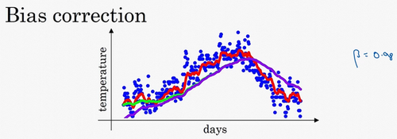
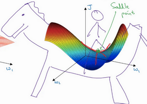

# Improving deep neural networks

[TOC]

## Mini-batch gradient descend

Vectorization allows your process the entire data, but when  the training example is huge, it will take a lot of time to update parameters. One thing we can do is divide the training set in smaller subsets and starts to make some progress even before your finish your process. 


Given inputs
$$
X= [x^{(1)},x^{(2)},x^{(3)},...,x^{(m)}] \\
Y= [y^{(1)},y^{(2)},y^{(3)},...,y^{(m)}]
$$
We can split the data into 
$$
X= [X^{\{1\}},X^{\{2\}}, X^{\{3\}},...,X^{\{n\}}] \\
Y= [Y^{\{1\}},Y^{\{2\}}, Y^{\{3\}},...,Y^{\{n\}}]
$$
which each $X^{\{t\}}$ contain a defined number of samples. For example if m = 5000000, we can use mini batch of 1000 each. Then each  $X^{\{t\}},  Y^{\{t\}}$ contain 1000 samples.

**Epoch**: single pass through the training set

### Implement mini batch gradient

```python
for t in 1 to range(m/batch_size): # Each batch t has batch_size examples, when finith that we have passed through all m samples, in other words, we have finished 1 epoch
	AL, caches = forward_prop(X{t}, Y{t}) # Vectorized implementation
	cost = compute_cost(AL, Y{t})
	grads = backward_prop(AL, caches)
	update_parameters(grads)
```

### Understanding mini-batch gradient descent


**Choosing your mini batch size**:

- Batch gradient descend:  batch size = m
- Stocastic gradient descend:  batch size = 1
- Mini batch gradient descent:  1< batch size <m:
- If small training set(m<2000): using batch gradient descend
- If m>2000, m could be 64, 128, 256, 512, (1024)
- Make sure mini batch that fit in CPU/GPU memory.

## Exponentially weighted averages ( Moving windows)

There are optimization algorithms that are better than gradient descent, but you first should understand exponentially weighted averages.

**Moving average**

Moving average is a technique widely used in time serie data. It is a calculation to analyze data points by creating a serie of averages of different subsets of the full dataset. 

Given a series of numbers and a fixed subset size, the first element of the moving average is obtained by taking the average of the initial fixed subset of the number series. Then the subset is modified by "shifting forward"; that is, excluding the first number of the series and including the next value in the subset.

**Exponentially weighted moving average**

An exponentially weighted moving average is a first.order infinit impulse response filter that applies weighring factors which decrease exponentially. **The weighting for each older datum decreases exponentially**, never reaching zero. 

The exponentially weighted average can be calculated recursively:
$$
S_{t}=\left\{
\begin{array}{ll}
{Y_{1},} & {t=1} \\ 
{\alpha \cdot Y_{t}+(1-\alpha) \cdot S_{t-1},} & {t>1}\end{array}\right.
$$
where:

- $\alpha$ represents the degree of weighting decrease, [0,1]
- $Y_t$ is the value at the time period t
- $S_t$ is the value of exponentially weighted average at any time period t.

For a given dataset of temperature
$$
\theta_{1} =40^{\circ} \mathrm{F},  \theta_{2} =49^{\circ} \mathrm{F}, \theta_{3} =45^{\circ} \mathrm{F}, \dots, \theta_{180} =60^{\circ} \mathrm{F},
\theta_{181} =56^{\circ} \mathrm{F}, \dots
$$
If we want to compute the average of moving average of the temperature, what we can do is:

- Initialize $v_0 =0$

- On every day, we are going to average it with a weight. 
  $$
  v_t = \beta v_{t-1} + (1-\beta) \theta_t
  $$
   where $v$ is the value of the previous day,  $ \theta$ is the temerature of today, and $\beta$ is the weight. For larger $\beta$ the curve is smooth but right shifted(because we are using a large windows), and for smaller $\beta$ the curve is more noisy (less data for average).

$V_t $ is approximately $\frac{1}{1-\beta}$ day's temperature, so for 
- $\beta = 0.9$, $\frac{1}{1-0.9}=10$, is approximately the average of the last 10 days temperature.
- $\beta = 0.98$,  $\frac{1}{1-0.98} = 50$
- $\beta = 0.5$,  $\frac{1}{1-0.5} = 2$

### Understanding exponentially weighted averages

$$
\begin{aligned} 
  v_{100} &=0.9 v_{99}+0.1 \theta_{100} \\ 
  v_{99} &=0.9 v_{98}+0.1 \theta_{99} \\ 
  v_{98} &=0.9 v_{97}+0.1 \theta_{98} 
\end{aligned}
$$

Expanding the equation:
$$
v_{100} = 0.1 \theta_{100} + 0.1 * 0.9 \theta_{99} + 0.1 * {(0.9)}^2 \theta_{98} + 0.1*(0.9)^3 \theta_{97}+ ...
$$


- $v_{100}$ can be computed as $\sum(\theta*weight)$ .
- All the coeficients sums aprroximately 1 , $ 0.1 + 0.1*0.9+0.1 * {(0.9)}^2+0.1 * {(0.9)}^3 + … \approx 1$
- How many days temperature we need to compute the average? $0.9^{10}$ is approximately 0.35 $\approx 1/e$, $(1-\epsilon)^{1/\epsilon} \approx 1/e$

Advantage: 

- speed
- memory
- one line of conde

### Bias correction in exponentially weighted averages



In the previous section we have the equation $v_t = \beta v_{t-1} + (1-\beta) \theta_t$. If we implement this formula, we don't actually get the green curve, but the purple one, which stars off very low. This is due to we initialize $v_0=0$, so $v_1  =0.98*0 + 0.02 \theta_{1}$ will relatively low and don't estimate very well first days temperature. As $v_{2}  =0.98*0.02 \theta_1+0.02 \theta_{2} $, $v_2$ is also very low comparing to $\theta_1$ and $\theta_2$. To make better the initial stage, instead of take $v_t$, take $\frac{v_t}{1-\beta^t}$. When t=2, $1-\beta^t=1-(0.98)^2$=0.0396, then $\frac{v_2}{1-\beta^t}=\frac{0.98*0.02 \theta_1+0.02 \theta_{2}}{0.0396} = 0.495 \theta_1 + 0.505 \theta_2$ , which is a more resonable value. In addiiton, when t become large, $\beta^t$ becomes 0, it makes almost no difference . For this reason, the purple line and the green line in the later stage overlaps, but during the initias stage, it corrects the purple line.
$$
v(t) = \frac{\beta v_{t-1} + (1-\beta) \theta_t}{1 - \beta^t}
$$

## Gradient descent with momentum

Gradient descent with momentum is faster than standart gradient descentt algorithm. 

The basic idea is to compute an exponentially weighted average of your gradients, and then use that gradient to update your weights instead.

Starting with the standard GD ( blue line)， which has a lot of oscilation in vertical direction, even though it reach to the red point. This oscilation reduces slow down the gradient descent and if we use a large learning rate, you might end up overshooting and diverge(left purple line) . What you want is to learn a bit slower in vertical axis but faster in horizontal axis. This can be done using gradient descent with momentum. (Horizontal: W, vertical: b)


**Momentum**

```pseudocode
vdW = 0, vdb = 0
on iteration t: # can be mini-batch or batch gradient descent
	compute dw, db on current mini-batch                
	VdW = beta * VdW + (1 - beta) * dW
	Vdb = beta * Vdb + (1 - beta) * db
	W = W - learning_rate * VdW
	b = b - learning_rate * Vdb

```

by add $VdW = beta * VdW + (1 - beta) * dW$, $Vdb = beta * Vdb + (1 - beta) * db$, we are doing exponentially weighted gradient, as the vertical axis oscilates, the average will be close to 0 whereas the horizontal axis is going to the right direction, so the average will be pretty big comparing to the vertical, thanks to that, we can get the red line.

- The most common value for $\beta$ is 0.9, which means we take last 10 iterations of gradient

- In practical peple don't use bias correction $\frac{V_{dW}}{1-\beta^t}$ because after 10 iteration our moving acerage will have warmed up and is no longer a bias estimate.
- In literature on gradient descent the term of (1 - beta) is usually omited. The effect of using this version is that $V_{dW}$ ends up with being scaled by a factor of 1/(1-beta), but is less intuitive because when we tune the hyper parameter beta, we may need to change alpha.

### RMSprop: root mean square prop

```pseudocode
vdW = 0, vdb = 0
on iteration t: # can be mini-batch or batch gradient descent
	compute dw, db on current mini-batch                
	SdW = beta2 * SdW + (1 - beta2) * dW^2
	Sdb = beta2* Sdb + (1 - beta2) * db^2
	W = W - learning_rate * dW/sqrt(Sdw+epsilon)
	b = b - learning_rate * db/sqrt(Sdb+epsilon)

```

- The square operation is element wise
- It computes the exponentially weighted average of the squares of the derivative
- When we look at the derivative, the slope is very large in the direction of b and very small at direction of W. As consequence,  
  -  $S_{dW}$ is relatively small -> $dW/sqrt(Sdw)$ will be larger -> faster propagation
  - $S_{db}$ is relativelly large -> $db/sqrt(Sdb)$ will be smaller -> less oscillation
- As effect, we can use larger learning rate.
- To ensure the dividing by 0 problem, add a small number $\epsilon$. 
- We use $\beta_2$ because in the next video we are going to combine RMSprop with momentum, so we avoid crash.

### Adam: adaptative moment estimation

momentum + RMSprop 

```pseudocode
vdW = 0, vdW = 0
sdW = 0, sdb = 0
on iteration t: # can be mini-batch or batch gradient descent
	
	compute dw, db on current mini-batch                
			
	vdW = (beta1 * vdW) + (1 - beta1) * dW     # momentum
	vdb = (beta1 * vdb) + (1 - beta1) * db     # momentum
			
	sdW = (beta2 * sdW) + (1 - beta2) * dW^2   # RMSprop
	sdb = (beta2 * sdb) + (1 - beta2) * db^2   # RMSprop
			
	vdW = vdW / (1 - beta1^t)      # bias correction
	vdb = vdb / (1 - beta1^t)      # bias correction
			
	sdW = sdW / (1 - beta2^t)      # bias correction
	sdb = sdb / (1 - beta2^t)      # bias correction
					
	W = W - learning_rate * vdW / (sqrt(sdW + epsilon))
	b = B - learning_rate * vdb / (sqrt(sdb + epsilon))
```

- Hyperparameters:
  - $\alpha$: needs to be tune
  - $\beta_1: 0.1$
  - $\beta_2: 0.009$
  - $\epsilon: 10^{-8}$ 
- When implementing Adam, what people usually do is just use the default value for $\beta_1, \beta_2, \epsilon$, then try a lot of values for $\alpha$. 

## Learing rate decay

Why learing rate decay?


Suppose that we are using mini batch gradient descend, and the batch size is not large, such as 64 or 129, in the iteration process there are noises(blue line), going toward to the optimal value, but can't reach it, because we are using a fixed value for $\alpha$. By reducing $\alpha$, we can satar with large learning rate, and decrease gradually, so it can reach to the optimal value.
$$
\alpha = \frac{1}{1+decayRate*epochNum}*\alpha_0
$$

- Exponential decay

$$
\alpha = 0.95^{epochNum}*\alpha_0
$$

- 

$$
\alpha = \frac{k}{\sqrt{epochNum}} * \alpha_0
$$

- Manual decay

## The problem of local optima

- In low dimension, we may get stuck in local optimas, such like:

  

- But when the dimension is high, it is unlikely to get stuck in a bad local optima. In high dimension, if the gradient is 0, so in each direction it can be concav or convex. But for example in 20000 dimensional space, if we want the local optima, each 20000 direction have to be concav or convex, which is very unprobable.

- In high dimension, it is more likely to get stuck into a the saddle point, which's derivative is 0.

  

- If local optim is not problem, which is the problem? Plateaus: derivative is close to 0 fo long time, it can make learning slow.

  

---

$\theta_1 = 10, \theta_2=10$ 

- Without correction:
  $$
  \begin{aligned}
  	v_0 & = & & & 0 \\
  	v_1 & = & 0.5*0+0.5*10& = & 5\\
  	v_2 & = & 0.5*5+0.5*10& = & 7.5\\
  \end{aligned}
  $$
  
- With correction:
  $$
  \begin{aligned}
  	v_0 & = & & & 0 \\
  	v_1 & = & (0.5*0+0.5*10)/(1-0.5^1)& = & 10\\
  	v_2 & = & (0.5*5+0.5*10)/(1-0.5^2)& = & 10\\
  \end{aligned}
  $$
  