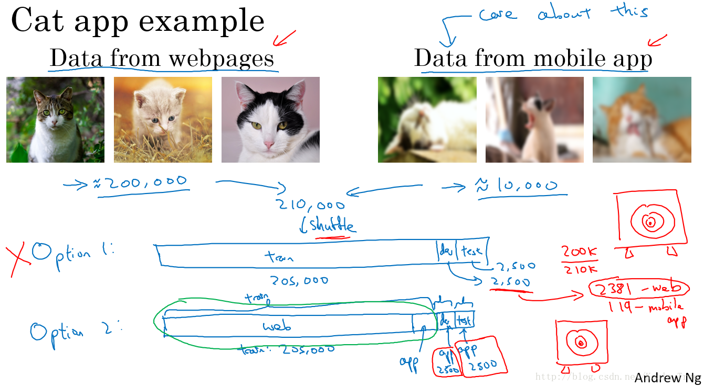
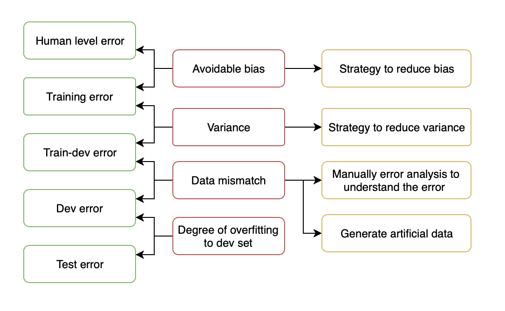
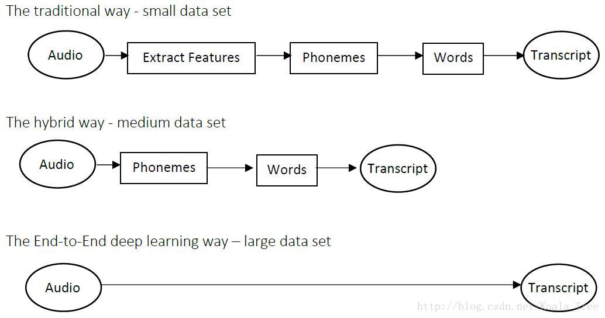

[TOC]

# Error analysis

Error analysis: manually examining mistakes that your algorithm is making. It can give you insights into what to do next.

- It is improvable?(Maybe the error is greater than human error)
- What we have to do to improve? Why those images are mislabeled?
- It worth to dedicate time to correct this error?

Example cat vs dog:

- Get 100 mislabeled dev set example
- Count up how many dogs are

Creating a table may help:

|    Image     |  Dog   | Great Cats | blurry  | Instagram filters |     Comments     |
| :----------: | :----: | :--------: | :-----: | :---------------: | :--------------: |
|      1       |   ✓    |            |         |         ✓         |     Pitbull      |
|      2       |   ✓    |            |    ✓    |         ✓         |                  |
|      3       |        |            |         |                   | Rainy day at zoo |
|      4       |        |     ✓      |         |                   |                  |
|     ....     |        |            |         |                   |                  |
| **% totals** | **8%** |  **43%**   | **61%** |      **12%**      |                  |

## Clean up incorrectly labeled data

- DL algorithms are quite robust to random errors in the training set 
- It is not robust to systematic error.

For dev set and test set, we have to do an error analysis:

| Image        | Dog    | Great Cats | blurry  | Incorrectly labeled | Comments                             |
| ------------ | ------ | ---------- | ------- | ------------------- | ------------------------------------ |
| 1            |        |            |         |                     |                                      |
| 2            |        |            |         | ✓                   | Labeler missed cat in the background |
| 3            |        |            |         |                     |                                      |
| 4            |        | ✓          |         |                     |                                      |
| ....         |        |            |         | ✓                   | Drawing of a cat: not a real cat     |
| **% totals** | **8%** | **43%**    | **61%** | **6%**              |                                      |

- Count the portion of miss labeled images.
- Look 3 number to look and decide if worth to  correct
  - Overall dev set error:			 10%
  - Errors due incorrect labels:   0.6% (6% of the 10% misclassified)
  - Error due to other causes:    9.4%
- The error due to incorrect labels is small, so it is not so important to correct it right now but focus on the other 9.4%
- However, when this proportion is high, we have to correct it

**Correcting incorrect dev/test set example**

- Apply same process to dev and test set to ake sure they continue to come from the same distribution
- Consider examining examples your algorithm got right as well as ones it got wrong. (Not always done if you reached a good accuracy)
- Train and (dev/test) data may now come from a slightly different distributions.
- It's very important to have dev and test sets to come from the same distribution. But it could be OK for a train set to come from slightly other distribution.

## Building your first system quickly, then iterate

- Set up dev/test set and metrics
- Build initial system quickly and see how it is doing
- Use bias/variance analysis and error analysis to priorize next steps

# Mismatched training and dev/test set

## Training and testing on different distributions

- A lot of teams are working with deep learning applications that have training sets that are different from the dev/test sets due to the hunger of deep learning to data.

- There are some strategies to follow up when training set distribution differs from dev/test sets distribution.

  1. Shuffle all the data together and extract randomly training and dev/test sets.(Not recommended).
     1. Advantages: all the sets now come from the same distribution.
     2. Huge disadvantages: in the dev and test there are only small portion ot data belongs to our target(In the example, only small portion of dev/test data belongs to the mobile image, but we don't care how it classifies webpage images)

  2. Use all the samples from other distribution for train, add small portion of target sample to train and others for dev/test.

     1. Advantages: the distribution you care about is your target now.

     2. Disadvantage: the distributions in training and dev/test sets are now different. But you will get a better performance over a long time.

Example: train speech recognition for the rearview mirrow of the car

|       Training        |     Dev/test     |
| :-------------------: | :--------------: |
|    Purchased data     | Speech activated |
| Smart speaker control | rearvier mirror  |
|    Voice keyboard     |                  |
|          ...          |                  |
|        500 000        |      20 000      |

We split the 20k data as 10k+5k+5k and build our training/dev/test set as:

- Train: 500k+10k
- Dev: 5k
- Test. 5k

## Bias and variance with mismatched data distribution

When the training dataset come from the different distribution of dev/test data, the way to analyse the bias and variance is different. 

For the cat classification example, we got 

- Human error: 0% 
- Training error: 1%
- Dev error: 10%

So we can conclude that the model is overfitting(high variance) because the dev error is larger than dev error. 

But when the data comes from different distribution we can't conclude, because there are other reasons that cause this phenomenon, for example the training data come from high quality images and the dev set come from blurry images. In this case, there are 2 things changed at time:

1. The algorithm saw data in the training set but not in the dev set
2. The distribution in the dev set is different.

To tease out these 2 effects, we can create a set called train-dev set as a random subset of the training set (which have same distribution as training sets, but not used for train ).

|                   |                            Case 1                            |                            Case 2                            | Case 3 | Case 4 |
| :---------------: | :----------------------------------------------------------: | :----------------------------------------------------------: | ------ | ------ |
| Human level error |                             0 %                              |                              0%                              | 4%     |        |
|  Training error   |                              1%                              |                              1%                              | 7%     |        |
|   Train-dev set   |                              9%                              |                             1.5%                             | 10%    |        |
|     Dev error     |                             10%                              |                             10%                              | 12%    |        |
|      Problem      | Large difference between train-dev and train when they comes from the same distribution -> high variance | Low variance because when it comes from the same distribution, the error difference is low, however, when it comes from different distribution, the error increase (1.5% -> 10%), which is caused because by data mismatch |        |        |

 

## Adressing data mismatch

- Carry out manual error analysis to try to understand difference between training and dev/test sets
- Make trianing data more similar or collect more data similar to dev/test sets
  - Artificial data synthesis.Be cautious and bear in mind whether or not you might be accidentally simulating data only from a tiny subset of the space of all possible examples so your NN might overfit to these generated data.

# Learning from multiple tasks

## Transfer learning

Retrain model trained for task A ->task B

As the earlier layers are used to recognize low level features, they are highly reusables. When we have similar task, we can changes the last layer by:

- Initialize weights of the last layer randomly
- Retrain the model on the new dataset

There are different options:

- For small dataset: retrain only last 1/2 layers(fine tuning)
- For large dataset: train all the parameters(pre training)

If you retrain all the parameters in the neural network, then this inital phase of training on iage recognition is called pertaining.

If you are updating all the weights afterward, then it is called fine tuning.

Transfer learning make sense:

- Task A and B have the same input x
- Yout have a lot more data for task A than task B
- Low level features from A could be helpful from learning B

## Multi task learning

Start off simultaneously traying to have 1 NN do several things at the same time, and each of these task helps hopefuly all of the other tasks

For example, in autonomous driving, we have to detect:

- Pedestraian 
- Cars
- Stop sigh
- Traffic light

$$
loss = \dfrac{1}{m}\sum\limits_{i=1}^{m}\sum\limits_{j=1}^{4}L(\hat y^{(i)}_{j},y^{(i)}_{j})=\dfrac{1}{m}\sum\limits_{i=1}^{m}\sum\limits_{j=1}^{4}(y^{(i)}_{j}\log (\hat y^{(i)}_{j})+(1-y^{(i)}_{j})\log(1-\hat y^{(i)}_{j}))
$$

- Note thant $\sum_{j=1}^4$ only sum over values of j with 0 or 1 label

The difference between this and soft max regression is that one image can have multiple labels. -> Multitask learning

**When multi-task learning make sense**

- Training on a set of tasks that could benefit from having shared lower level features
- Usually: amount of data you have for each task is quite similar.
- Can train a big enough neural network to do well on all the tasks

# End to end deep learning

## What is end to end deep learning?

End to end deep learning way: directly map input to output skipping intermedia steps.

Challenge of end to end deep learning: it need large dataset to work well

In practice, we may need some intermedia steps:

- Face recognition system: Image -> Face detection ->Face recognition. This approach work better because :
  1. Each of the 2 problem you are solving is actually much simpler
  2. You have a lot of data for each of the 2 subtasks
- Machine translation

## Whether to use end to en deep learning

Pros:

- Let the data speak
- Less hand designing of components needed

Cons:

- May need large amount of data
- Excludes potentially useful han designed compunents(may be very useful when the dataset is small)

**Applyging end to end DL**

Key question: do you have sufficient data to learn a function of the complexity needed to map x to y?

When you want to use ML or DL to learn some individual components and when applying supervised learning you should carefully choose what type of X to Y mapping you want to learn depending on what task you can get data for.