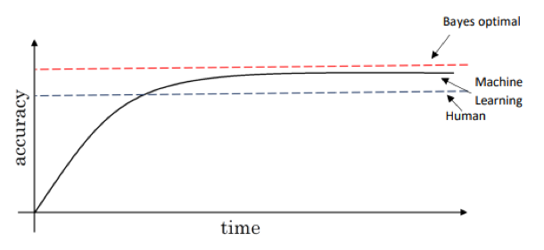

[TOC]

# Introduction to ML strategy

Orthogonalization: know what to tune to improve something

Chain of assumptions in ML:

1. Fit training set well on cost function
   - Bigger network
   - Adam
2. Fit dev set well on cost function
   - Regularization
   - Bigger training set
3. Fit test set well on cost function
   - Bigger dev set
4. Performs well in real world
   - Change dev set or cost function

Try to not use early stopping

# Setting up your goal

## Single number metric

When we have to pick 1 model, instead of using 2 parameters: precision or recall, it is better to use only 1 parameters: F1 score
$$
F1_{score} = 2*\frac{P*R}{P+R}
$$
Or when we are working with more than 2 parameters, we can compute the average.

## Satisficing and optimizing metric

When there are more then 1 parametrs we care about, for example accuracy and running time, we can set up conditions, we can set accuracy as an optimizing parameter and running time as an satisfactory parameter, for example, it is ok when the running time is less than 100ms.

If we have N metrics,

- 1 optimizing
- N-1 satisfactory

## Train/dev/test set

**Distribution**

Train different models with train set, then use dev set to evaluate the different ideas and pock one, an keep innovating to improve dev set performance until finally, you have one clause that you're happy with that you then evaluate in the test set.

Dev and test set must have the same distribution

**Size**

When <10000 sampples

- 70% Train 30% test
- 60% Train 20% dev 20% test

When >1000

- 98% train 1% Dev 1% test

Test set: big enough to give high confidence in the overall performance of your system

For some applications, maybe all you need is train and dev set, not having test set might be ok, but it is better to have a test set

**Change dev test sets and metric**

When the evaluation metric is not giving the correct rank order preference for what is actually batter algorithm, it is time to think about defining a new evaluation metric.

For example, we have 2 algorighms for clasiffy cat images, A has 3% error and B has 5% error, however, A classifies pornographic image as cat, which is unacceptable, so we have to change the evaluation metric,
$$
Error=\frac{1}{m_{dev}} \sum_{i=1}^{m_{dev}} w^{i} L\{ y_{pred}^{i},y^{i}\}
$$
Where $w^{i}$ is the weight that we gives to each type

If is doing good in the dev but not well in the real application ( for example dev test set have high quality image and user image has low resolution)

# Comparing to human level performance

In some cases the machine learning do better than human, so it is natural to compare that.

Bayes optimal error: the error that we never can surpass.

For task that humans are quite good at, as long as ML is worse than human, you can

- Get labeled data from human
- Gain insight from manual error analysis: why did person get this right
- Better analysis of bias/variance

## Avoidable bias

For example:

| Human error | Train error | Dev error | Action          |
| ----------- | ----------- | --------- | --------------- |
| 1%          | 8%          | 10%       | Reduce bias     |
| 7.5%        | 8%          | 10%       | Reduce variance |

Depending on human level error, which is very close to bayes error(The best error we can get), we take different actions.

When the error is smaller than human error, there is room for improve the algorithm, when it surpass the human error, we can still improve to bayes error, but it will be more difficult.

Avoidable bias: difference between human and training error, in the second car, 0.5%

Avoidable variance: difference between dev and training error.

## Understanding human level performance

Human level error is a proxy for bias error. 

In the example of medical image classification example, suppose that

- Typical human: 3% error
- Typical doctor: 1% error
- Experienced doctor: 0.7% error
- Team of experienced doctor. 0.5% error

We should use team of experienced doctor error as human level error.

Depending on the purpose, we define different human level error

## Improving your model performance

Assumptions of supervized learning

1. You can fit the training set pretty well (Avoidable bias)
2. The training set performance generalized pretty well to the dev/ test set(Variance)

