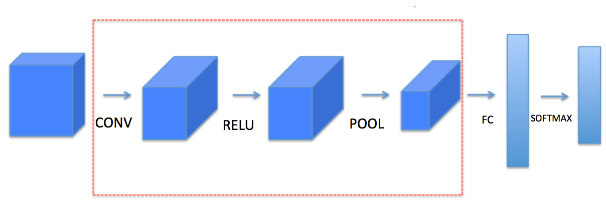
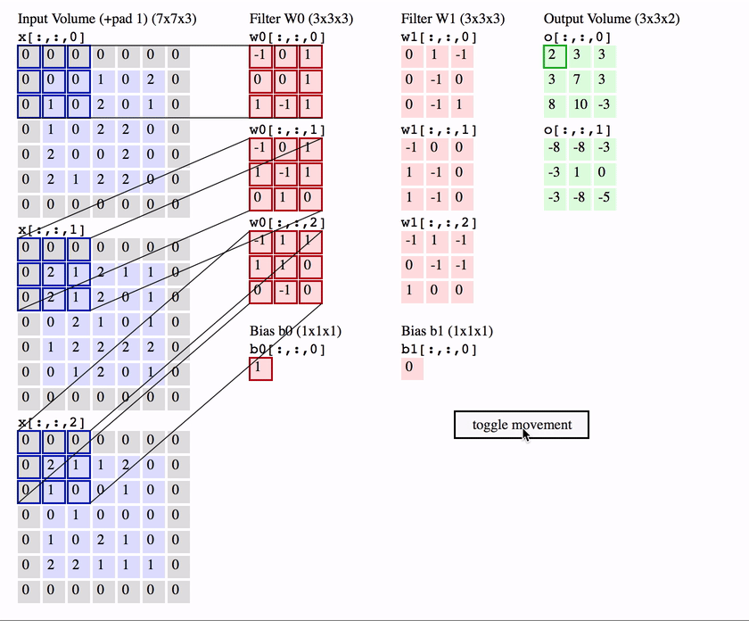
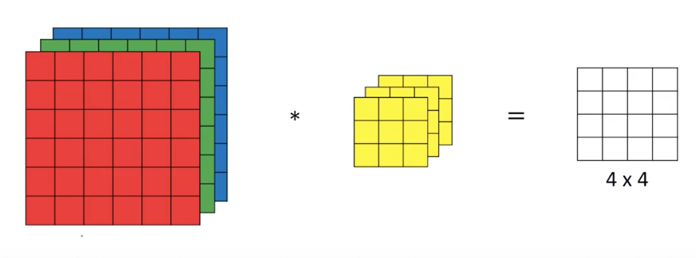
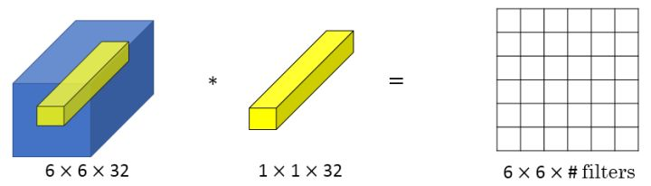
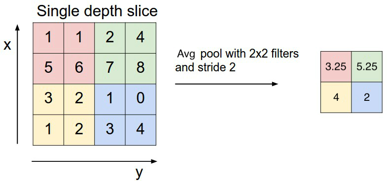

[TOC]

# Convolutional neural networks

Convolutional neural network is quite silmar to regular neural nets, but it makes explicit assumption that the inputs are images and use convolution operation.

The regular neural nets receive an input, and transform it through a series of hidden layers. Each hidden layer is made up with a set of neurons, where each neuron is fully connected to all neurons in the previous layer, and where neurons in a single layer function completely independently and don't share any connection. The last fully connected layer is called output layer.

However, when inputs are images, there are 2 characteristics:

- The number of parameters can be huge: 
  - For 32x32x3 images, the number of parameters for a single image is 3072
  - For 200x200x3, 120000
- The features have spatial relationship.

The use of convolutional neural network can:

- Detect spatial and temporal informations (Image features)
- Reduce number of parameters:

We will see it later.

## Basic components of convolutional neural network




A simple convolutional neural network has following architecture:

- Input layer: original RGB pixels
- Convolutional layer: compute the output that are connected to local region in the input by dot product of the input and filter.
- Activation: elementwise activation.
- Pooling: downsampling along the spatial dimension
- Fully connected layer: compute the class score

# ConvNet Layers:

## Convolution

What is called convolution in deep learning is cross correlation.

The convolution operation makes the **dot product of the filter and the local region of the inputs.** 



### Edge detection

We can detect different type of edged defining the kernel: 

- Vertical filter: bright in the left and dark in right

- Horizontal filter: bright in the upper and dark in the bottom

$$
\begin{array}{cc}
Vertical = \left[ \begin{array}{ccc}{1} & {0} & {-1} \\ {1} & {0} & {-1} \\ {1} & {0} & {-1}\end{array}\right] & 
Horizontal = \left[ \begin{array}{ccc}{1} & {1} & {1} \\ {0} & {0} & {0} \\ {-1} & {-1} & {-1}\end{array}\right]
\end{array}
$$
- Sobel: put more weight in the central, which makes it more robust.

$$
Sobel = \begin{bmatrix}
{1} & {0} & {-1} \\ {2} & {0} & {-2} \\ {1} & {0} & {-1}
\end{bmatrix}
$$

- Scharr:
  $$
  Scharr=\left[ \begin{array}{ccc}{3} & {0} & {-3} \\ {10} & {0} & {-10} \\ {3} & {0} & {-3}\end{array}\right]
  $$


But in the DL we don't have to manually pick those weights, but treat it as parameters to learn.

### Padding

There are 2 downsides when apply convolution:

1. Each time we apply convolution the image will shrink(reduce size), the output size is equal to $$ [n,n]*[f, f] = [n-f+1, n+f+1]$$ where n is the input size, f is the filter size。

2. Pixel at the corner or the edge are difficult to be detected because they are only used once whereas other pixels are used multiple times.

To solve this problem, we use padding: add pixels to the edges, in general we pad with 0. Notice that when we say we use pad p, we add p row/col at left, right, upper and bottom, so the dimension is increased $2p$

|                     Without padding                     |                        With pad 1                         |
| :-----------------------------------------------------: | :-------------------------------------------------------: |
|  |  |

#### Valid and same convolution

|       | Input | Filter | Padding |    Output     |
| :---: | :---: | :----: | :-----: | :-----------: |
| Valid |  nxn  |  fxf   |    0    | n-f+1 x n-f+1 |
| Same  |  nxn  |  fxf   |    p    |      nxn      |

- Same: the output has the same size as input.
  $$
  \begin{aligned}
  	n+2p-f+1 =n \\
  	p=\frac{f-1}{2}
  \end{aligned}
  $$

- By convention f is usually odd

```python
X_pad = np.pad(X,((0,0),(pad,pad),(pad,pad),(0,0)),'constant',constant_values = 0)
```


### Stride

Stride is the step that the filter moves. When the stride is 1 then we move the filters one pixel at a time. When the stride is 2 (or uncommonly 3 or more, though this is rare in practice) then the filters jump 2 pixels at a time as we slide them around. This will produce smaller output volumes spatially.

When we add stride, the output size is defined as:


$$
[n,n]*[f, f] = \left\lfloor \dfrac{n+2p-f}{s}+1 \right\rfloor\times \left\lfloor \dfrac{n+2p-f}{s}+1 \right\rfloor
$$

- where $\lfloor \rfloor$ means floor(round down to integer, 7.7->7 ) 

In the example below, we use s=2, so in each step it moves 2 pixels.


### Convolution over volume

Images usually has 3 channels RGB, in this case, the input size is [height, width, depth]. In this case, we use 3D filter with size[f, f, depth]



We can define different filter to each depth, for example
$$
\begin{array}{ccc}
  R=\begin{bmatrix}
  1 & 0 & -1\\
  1 & 0 & -1\\
  1 & 0 & -1\\
  \end{bmatrix} &
  G=\begin{bmatrix}
  0 & 0 & 0\\
  0 & 0 & 0\\
  0 & 0 & 0\\
  \end{bmatrix} &
  B=\begin{bmatrix}
  0 & 0 & 0\\
  0 & 0 & 0\\
  0 & 0 & 0\\
  \end{bmatrix} \\
\end{array}
$$

### 1x1 convolution

Normally signals are 2-dimensional so 1x1 convolutions do not make sense (it’s just pointwise scaling). However, in ConvNets this is not the case because one must remember that we operate over 3-dimensional volumes, and that the filters always extend through the full depth of the input volume. For example, if the input is [32x32x3] then doing 1x1 convolutions would effectively be doing 3-dimensional dot products (since the input depth is 3 channels).



In addition, we not only have 1 units, we usually have several units, so the result is 6x6xnum_filters. 

One way to think about the 1x1 filter is that, it is basically having a fully connected neural network, that applies to each 32 position

It is normally called network in network.

- It can be used to shrink the number of channels without reducing height and width
- It can also keep the number of channels, but add non linearity because we apply ReLu after the convolution.

### Multiple filters

Instead of 1 filter, we can use multiple filters so it allows us to detect multiple features.

The output is defined as
$$
[n,n,n_c]*[f, f, n_c] =[n-f+1, n-f+1, n_c']
$$
where $n_c'$ is the number of filters

Now we can detect $n_c'$ diffenrent features in stead of 1

### One layer of a convolutional network

To summarize, the conv layer:

- Accepts input with size $n_H^{[l-1]}*n_W^{[l-1]}*n_C^{[l-1]}$ where H is height, W is width and C is channel and $[l-1]$ means it the previous layer

- Requiere 4 hyperparameters:
  - $f^{[l]}$= filter size
  - $n_c^{[l]}$= number of filters in layer $l$
  - $p^{[l]}$= padding size
  - $s^{[l]}$= stride
  
- The forward propagation is defined as $Z ^{[l]}= W^{[l]}a^{[l-1]}+b^{[l]}$, so :
  - $a^{[l-1]}$ is the activation of the previous laver, with size  $n_H^{[l-1]}*n_W^{[l-1]}*n_C^{[l-1]}$ 
  - $W^{[l]}$ is the filter, with size $W^{[l]}=f^{[l]}*f^{[l]}*n_C^{[l-1]}*n_C^{[l]}$
  - $b^{[l]}$ is thebias: $$b^{[l]}=1*1*1*n_C^{[l]}$$

- Then the output will be $n_H^{[l]}*n_W^{[l]}*n_C^{[l]}$ where:

- $$
  \begin{aligned}
  n_H^{[l]} = \lfloor \frac{n_H^{[l-1]}+2p^{[l]}-f^{[l]}}{s^{[l]}} +1\rfloor\\
  n_W^{[l]} = \lfloor \frac{n_W^{[l-1]}+2p^{[l]}-f^{[l]}}{s^{[l]}} +1\rfloor
\end{aligned}
  $$
  
- Notice that the total number of parameters will be $W^{[l]}+b^{[l]}$

```python
s = np.multiply(a_slice_prev,W) 
Z = np.sum(s)
Z = float(Z)+b
```


## Why of convolution?

- **Parameter sharing**: if one feature is useful to compute at some spatial position (x,y), then it should also be useful to compute at a different position (x2,y2).
- **Sparsity of connections**: in each layer, each output value depends only on a small number of inputs.

For example, if the input image is of size 32x32x3 and we apply convolution with f=5 and $n_c=6$:

- Input layer: 32x32x3 = 3072
- Output layer ($n_H^{[l]}=n_W^{[l]}=\frac{n_H^{[l-1]-}-f+1}{s}$): 28x28x6=4704
- If they are fully connected, the weight matrix will be $3071*4074 \approx 14M$

Thanks to those 2 properties we use the same filter along the depth of the input layer, they will share the weight and bias:

- $W^{[l]}+b^{[l]}=f^{[l]}*f^{[l]}*n_C^{[l-1]}*n_C^{[l]}+n_C^{[l]}=5*5*3*6+5=456$ parameters.
- Output size  will alway reduce height and width but increase depth.

The number of parameter reduced from $14M$ to 456 thanks to parameter sharing and sparsity of connection. In addition, the convolutional neural network use these charecteristics to prevent overfitting. 

Sometimes the parameter sharing assumption may not make sense, This is especially the case when the input images to a ConvNet have some specific centered structure, where we should expect, for example, that completely different features should be learned on one side of the image than another.  For example when we are making face recognition,  you might expect that different eye-specific or hair-specific features could (and should) be learned in different spatial locations ( For example we have 2 eyes.) In thise case, it is called locally connected layer.


## Pooling layers

It is common to periodically insert a pooling layer in-between successive conv layers in a convnet.

**Why use pooling layers?**

-  Reduce spatial size -> reduce number of parameters ->speed up the computation 
- Make some of the features that detects a bit more robust, reducing overfitting

In general, the pooling layer:

- Accepts a volume of size $n_H^{[l-1]}*n_W^{[l-1]}*n_C^{[l-1]}$

- Define type of pooling:

  - Max pooling: slides an (f,f) window over the input and stores the max value of the window in the output.

    - It makes assumption that if the feature is detected at the region defined by the filter size(High values), it still remain in the output. If these feature doesn't exist, after the maximum it is still small.

  - Average pooling:  slides an (f,f) window over the input and stores the average value of the window in the output.

    |      Pooling over volume      |           Max pooling            |          Average  pooling           |
    | :---------------------------: | :------------------------------: | :---------------------------------: |
    |  |  |  |

  

- Requires 2 hyperparameters: filter size $f$ and stride $s$

  - The common used value for f and s is $f=2, s=2$ or $f=3, s=2$

- It produces a volume of size:  $n_H^{[l]}*n_W^{[l]}*n_C^{[l]}$ where

  - $n_H^{[l]}=\frac{n_H^{[l-1]}-f}{s}+1$
  - $n_W^{[l]}=\frac{n_H^{[l-1]}-f}{s}+1$
  - $n_C^{[l]}=n_C^{[l-1]}$

- It introduces zero parameters since it computes a fixed funtion of the input.

- It is not common to pad the input using zero padding.

Our NN don't learn from pooling.

Max pooling is more used than average pooling, except when 

They also suggest getting rid of pooling: [Striving for Simplicity: The All Convolutional Net](http://arxiv.org/abs/1412.6806)

## Fully connected layer

Neurons in a fully connected layer have full connections to all activations in the previous layer, as seen in regular Neural Networks. Their activations can hence be computed with a matrix multiplication followed by a bias offset.

# ConvNet architecture

**Layer patterns**

The most ConvNet architecture follows the pattern:

`INPUT -> [[CONV -> RELU]*N -> POOL?]*M -> [FC -> RELU]*K -> OUTPUT`

Tips:

- *Prefer a stack of small filter CONV to one large receptive field CONV layer*.

- Look architectures in the literature.
- Download pretrained model and fine tune on your data.

**Layer size patterns**

- Input layer:  should be divisible by 2 many times. Common number include 32, 64, 96, 224, 284 and 512
- Conv layer: 
  - should be using small filters (e.g. 3x3 or at most 5x5), using a stride of s=1, and crucially, 
  - padding the input volume with zeros in such way that the conv layer does not alter the spatial dimensions of the input.
  - If you must use bigger filter sizes, it is ony common to see on the very first conv layers.
- Pool layer: most common setting is to use max pooling with 2x2 receptive field and stride 2, which discards 75% of activations. Other less common is f=3 and s=2.

# Further reading

[CS231 Convolutional Neural networks](https://cs231n.github.io/convolutional-networks/)

[Convoluton aritmetics gif](https://github.com/vdumoulin/conv_arithmetic)