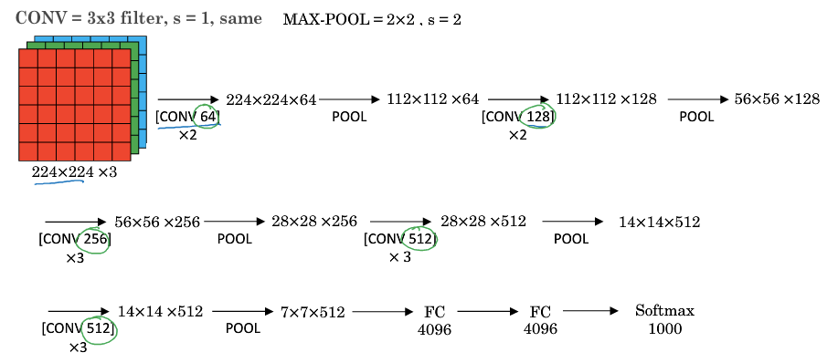
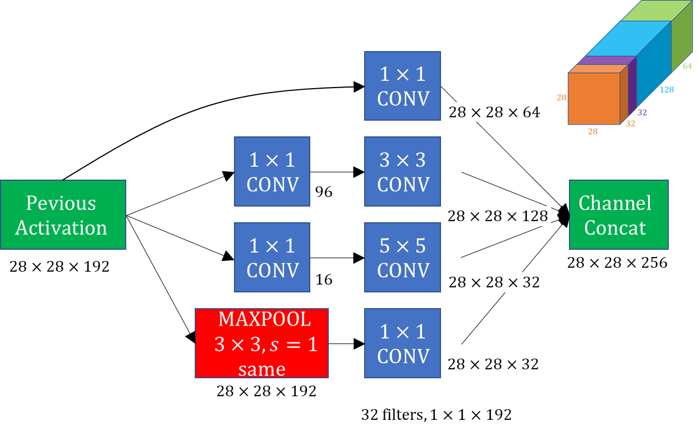

[TOC]

# Case studies

Classic networks

- LeNet-5
- AlexNet
- VGG

New networks

- Resnet
- Inception

## LeNet-5

- Designed for handwritnen digits, so the input channel =1

- Height and width decrease and channels increase
- Conv pool conv pool Fc Fc output 
- Sigmoid and tanh
- Non linearity after pooling later
- 14k parameters
- Read section 2 and 3

## Alex net

https://papers.nips.cc/paper/4824-imagenet-classification-with-deep-convolutional-neural-networks.pdf

- Large stride=4 -> large stride
- Similar to Lenet, but larger. 
- 60M parameters
- Relu activation function
- Local response normalization: for each position in the 13x13 image, may not want to activate too much neurons. In practical not used.

## VGG16

- Focuse on conv laters
- Simplicity
- Conv = 2x3 filter, s=1, same padding
- There are 16 layers with weight
- max pooling 2x3, s=2
- Filter size double from 64 .>128 -> 256 -<512
- 138M parameters
- VGG16 is does almost as well as VGG19, so people prefer VGG16

## ResNet

In a plaine network(networks that we have seen before), in theory as your increase the depth of the network, it should only do better and bettter in the training set, however, in the reality, having a very deep means the optimization algorithm just has a much harder time trining due to **gradient vanishing and exploding**, so the training error gets worse if the network is too deep.ResNet comes to resolve this problem.

(The vanishing/exploding effect occures when your derivatives become very small or very large.  )

The key component of the ResNet is **residual block**: which skips some connection by copying previews layer to later layer.

|               Plain network               |                   ResNet                    |
| :---------------------------------------: | :-----------------------------------------: |
|  $z^{[l+1]}=W^{[l+1]} a^{[l]}+b^{[l+1]}$  |   $z^{[l+1]}=W^{[l+1]} a^{[l]}+b^{[l+1]}$   |
|    $a^{[l+1]}=g\left(z^{[l+1]}\right)$    |     $a^{[l+1]}=g\left(z^{[l+1]}\right)$     |
| $z^{[l+2]}=W^{[l+2]} a^{[l+1]}+b^{[l+2]}$ |  $z^{[l+2]}=W^{[l+2]} a^{[l+1]}+b^{[l+2]}$  |
|    $a^{[l+2]}=g\left(z^{[l+2]}\right)$    | $a^{[l+2]}=g\left(z^{[l+2]}+a^{[L]}\right)$ |

With resnet, even the number of the layer is deeper, the performance don't worse. It relly help the vanishing and expoding gradient problem.

**Why ResNets work**

Suposse that we have a big NN, Which input is X, that outputs $a^{[l]}$.  If we add 2 layer, the output will be $a^{[l+2]}$. If we use relu activation function: then all activations will be greater than 0.
$$
a^{[l+2]}=g\left(z^{[l+2]}+a^{[L]}\right) = g \left( W^{[l-1]}a^{[l-1]}+b^{[l-1]} + a^{[l]}\right)
$$
When we apply L2 regularization, that will tendes yo shrink the value of $W^{[l+2]}$ is shrinked. If we apply weight decay to B that will also shrink this. 

If $W^{[l+1]}=0$ and $b^{[l+1]}=0$, then $a^{[l+2]}=g \left( a^{[l]}\right)$ . As we are applying ReLu, and a is non negative, $a^{[l+2]}=a^{[l]}$. Identity function is easy for residual block to learn. This is why add those 2 layer doesn't heart performance.

Notice that the addition suppose that $z^{[l+2]},a^{[L]}$ has the same dimension, so they are using same convolution.

If the dimension is different, we introduce $Ws$:
$$
a^{[l+2]}=g\left(z^{[l+2]}+a^{[L]}\right) = g \left( W^{[l-1]}a^{[l-1]}+b^{[l-1]} + W_sa^{[l]}\right)
$$

## Inception network

Instead choosing what filter size you want in a conv layer, or ever do you want a convolutional layer or pooling layer, let do them all.

But there is a problem: computational cost. But we can use 1x1 convolution to reduce cost.

- Layers in the middle is not too bad for prediction

# Practical advices for using ConvNets

## Transfer learning

Small training set:

- Download pre trained network
- Eliminate the last layer and create your own softmax layer
- Frozen other layers
- We can precompute the result from layer 0 to layer l-1 and save it to disc, because it don't change.

Larger training set:

- Freeze less layers
- Training more layers

A lot of data

- Use the whole network as initialization and retrain.

## Data augmentation

- Mirroing 
- Random crop
- Rotation
- Shearing
- Local warping
- Color shifting, add RGB channels different distortion. because the color could be changed by different reasons, but the label must still remain.
  - We can use PCA to do color augmentation.

## State of computer vision

When we have little data, we use more hand engineering. When the amount of data is large, we can use simpler algorithms and use less hand engineering.

There are 2 ssources of knowledge:

- Labeled data
- Hand engineered features/network architectures/otehr components 

Tips for doing well on benckmarks/winning competitions:

- Ensembling: 
  - Trai several networks independently and average their outputs(3-15Networks)
- Multi crop at test time
  - Run classifier on multiple version of test images and average results.

Use open source code:

- Use architectures of networks published in the literature
- use open source implementations if possible
- Use pretrained models and fine tune it for your dataset

