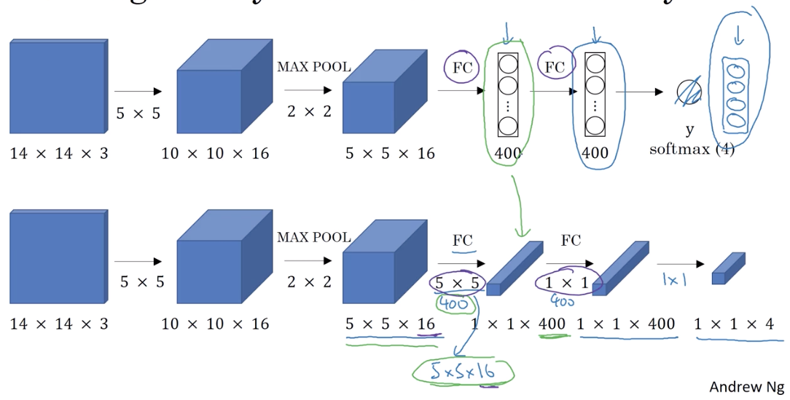
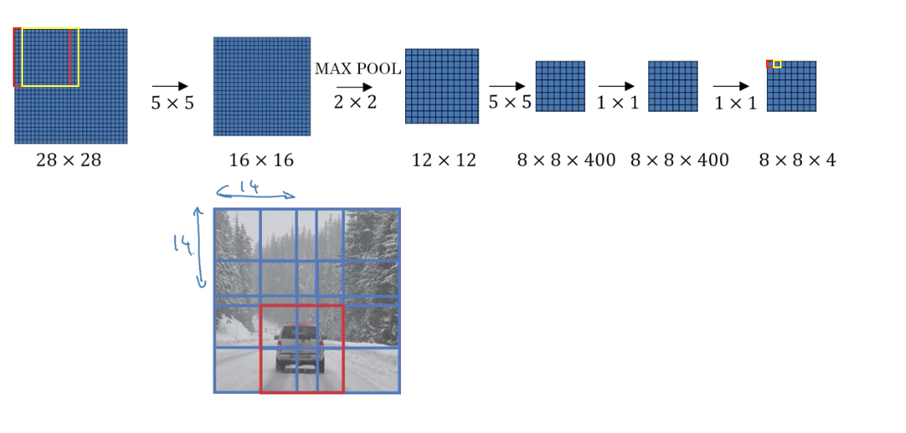
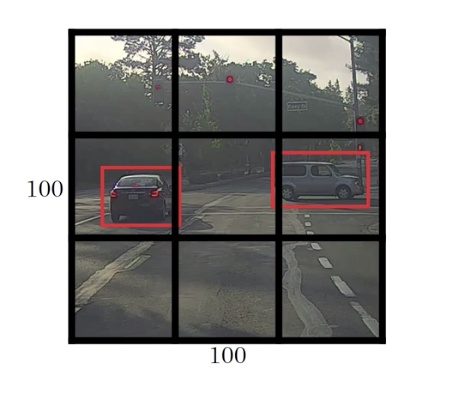
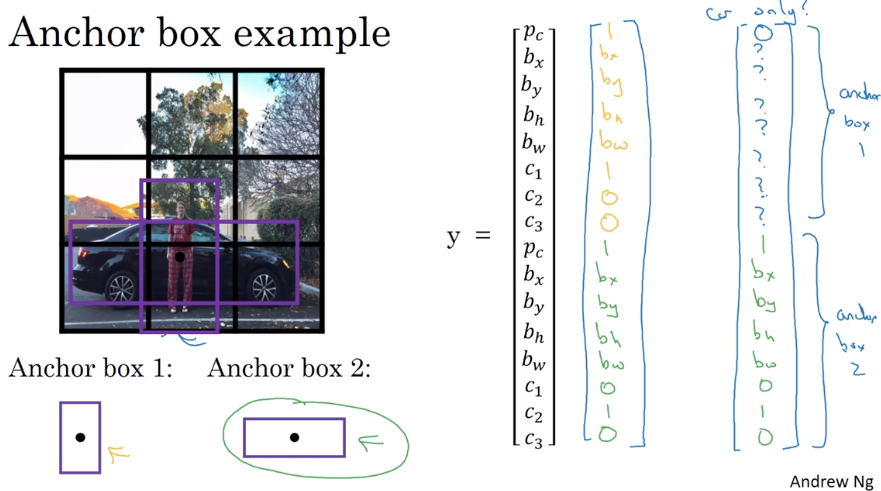
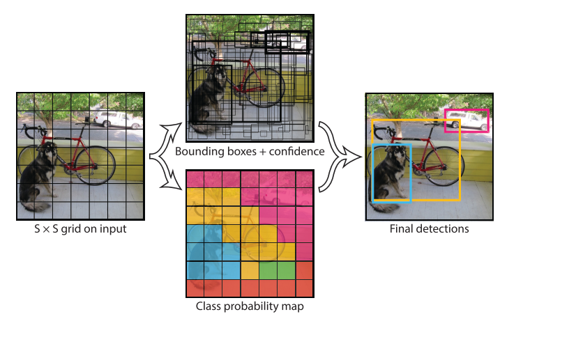
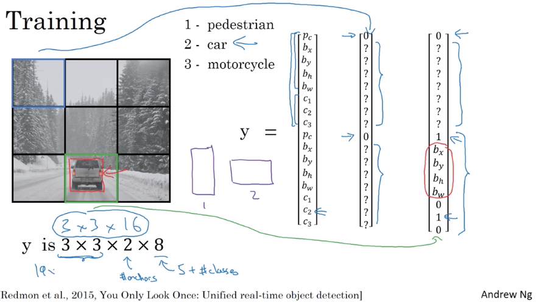
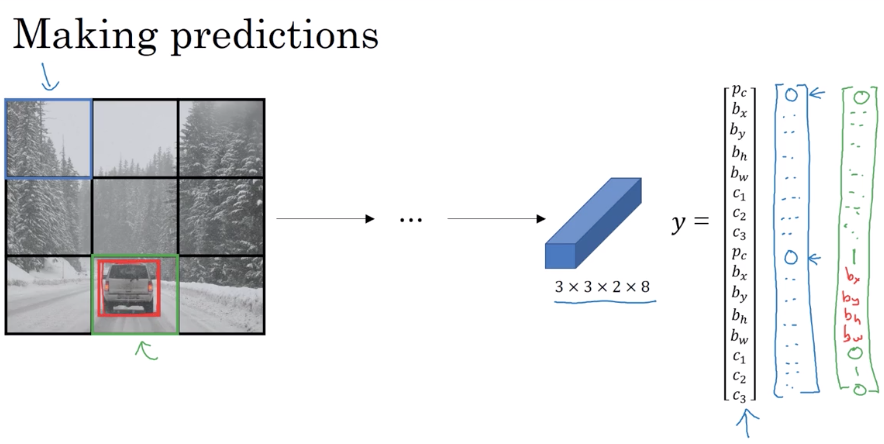

[TOC]

# Object localization

Object detection = image classification + location

 **Defining the target label y**

For the example we have 4 classes: pedestrian, car, motorcycle and background.

Need to output $b_x, b_y, b_h, b_w$ and class label(1-4)
$$
y^{T}= \begin{bmatrix}
p_c & b_x & b_y & b_h &b_w &c_1 & c_2 &c_3
\end{bmatrix}
$$
where $p_c$ is the probability that there is an object and $c_1, c_2, c_3$ the class label

If there is a car, then $$y^{T}= \begin{bmatrix}
1 & b_x & b_y & b_h &b_w &0 & 1&0
\end{bmatrix}$$

When there is nothing: $$y^{T}= \begin{bmatrix}
0 & ? & ? & ? & ? & ? & ? & ?
\end{bmatrix}$$, we don't care about other elements

The loss is defined as
$$
L(\hat{y}, y) = \left\{ 
	\begin{array}{lcc}
  \left(\hat{y}_{1}-y_{1}\right)^{2}+\left(\hat{y}_{2}-y_{2}\right)^{2}+\cdots+\left(\hat{y}_{8}-y_{8}\right)^{2} & if & y_i=1 \\
 (\hat{y}_i-y_i)^2 & if & y_i=0
\end{array}
\right.
$$

## Landmark detection

We can define landmarks, such as eyes,  mouth, etc. Then the output will add for each landmark $(l_{1x}, l_{1y}), (l_{2x}, l_{2y})...(l_{nx}, l_{ny})$

We also can make it to output the position.

## Object detection

We can start with training a conv net for a specific object, for example cars, then using a sliding windows to detect where is the car. Then we can increase the filter size and the repeate the process.  With sliding windows we can detect where is the car, but there is a huge disadvantage: the computational cost.

## Convolutional implementation of sliding windows

**Turn FC layer into conv layers**

It can be converted to convlayer by change the flatten to convolution



Convolution



In this example,  we start with an input which's size is 28x28, by forward propagation we got an output of 8x8x4. This corresponds to using a sliding windows with size 14x14 and stride 2((28-14)/2+1=8) and each pixel of the output corresponds to the value inside the sliding windows.

Now instead tof doing it sequentially, with this convolutional implementation, we can implement the entire image and make predction. In this implementation, the common area share parameters, reducing the computational cost.

## Bounding box prediction

The convolutional implementation is more efficient, but it may not predict the perfect boudingbox. A good way to do that is YOLO algorithm.

YOLO:



1. Divide image in grids, in this case 3x3
2. For each grid cell, specity a label Y, 
   1. For grid(0,0), $y^{T}= \begin{bmatrix}
      0 & ? & ? & ? & ? & ? & ? & ?
      \end{bmatrix}$
   2. The left car is in the grid(1,0) and (1,1):  what YOLO does is it makes the midpoint of each of 2 objects and then assign the object to the grid cell containing the midpoint. So the left car is assigned yo grid (1,0). $y^{T}= \begin{bmatrix}
      1 & b_x & b_y & b_h &b_w &0 & 1&0
      \end{bmatrix}$
   3. For the same reason, the right car is assigned to grid (1,2). $y^{T}= \begin{bmatrix}
      1 & b_x & b_y & b_h &b_w &0 & 1&0
      \end{bmatrix}$

The output vector's size is 3x3x8

**How to compute boundingbox?**

$b_x, b_y, b_h, b_w$ are defined relative to the gread cell. So $b_x, b_y$, which represents the midpoint, must between 0 and 1 but $b_h, b_w$ can be greater than 1.

For example, for the right car:

- $b_x \approx0.4$
- $b_y \approx 0.3$
- $b_h \approx 0.5$
- $$b_w \approx 0.9$$

## Intersection over union

We use intersection over union(IoU) to evaluate the mode's performance. 


$$
\begin{aligned}
IoU&=&\frac{Intersection}{Union}
\end{aligned}
$$
The answar is correct if $IoU\ge0.5$, but we can increase those threshold to make more accurate prediction


## Non maximum supression

When the detector detect the object more than once, we have to eliminate other boundingboxes and keep only 1 for object.

For the car detection example, we divide the input in 19x19 grid and each output prediction is $[p_c, b_x, b_y, b_h, b_w]$:

- discard all boxes with $p_c \le 6$
- While there are any remaining boxes:
  - Pick the box with the largest $p_c$, output that as a prediction
  - Discard any remaining box with $IoU \ge0.5$ with the box output in the previous step


## Anchor boxes

Previously, each object in training image is assigned to grid cell that contains that object's midpoint, so the output's shape is 3x3x8 in this example.

But one grid can contain more than 1 midpoints. So we define different anchor boxes.

In this example, the person is similar to the anchor box 1 and the car is more similar to anchor boxes 2.



With 2 anchor boxes, each object in training image is assignes to grid cell that contains object's midpoint and anchor box for the grid cell with highest IoU. Now the output will be 3x3x2x8

How to chose anchor boxes:

- By hand, 5-10 anchor box shapes that spans a variety of shapes that seems to cover the types of object you seem to detect.
- More advanced version is use means algorithm to group together 2 type of objects shapes tou tend to get, and then select a set of anchor boxes that is most representative for this class.

## Yolo algorithm

Now we hace see the most import components of the yolo, let put them together.



1. Divide the input image to sxs grid cells
2. If the center of the object falls into a grid cell, that grid cell is responsible for detecting that object
3. Each grid cell predict B bounding boxes and confidence score of those boxes.
   1. Each bb consist of 5 predictions: $x, y, h, w, confidence$ 
      - $x, y$ is the center, defined with respect the grid
      - h, w is defined respect the whole image
      - confidence score is defined as $Pr(Object)*IoU^{truth}_{pred}$
4. Each grid also predict the c conditional classes,the probabilitie that this grid contain class i where there is an object.  $Pr(class_i/Object)$
5. Only one set of class probabilities per class grid, regardless of the number of box B
6. At the test time, $Pr(class_i/Object)*Pr(object)*IoU^{truth}_{pred}=Pr(class_i)*IoU^{truth}_{pred}$




In this example, we use 3x3 grid, 2 anchor boxes, and we want to detect 3 classes, so the output's size is(3x3x2x8)



Notice that for the green cell, the car is more similar to the anchor box 2, so we have assigned value for the second anchor box where for the first we don't mind.

## Region proposal

Why Region proposal? Because the large part of the image don't contain interest features.

RCNN: 

- propose region, clasify proposed regions one at a time. Output bounding boxes

Fast R-CNN:

- propose regions, use convolution implementation of sliding windows to classify all the proposed regions

Faster R-CNN: use convolutional network to propose regions


---

# How to program…?


In this example, 

- The **input** is a batch of images of shape (m, 608, 608, 3)
- We will use 5 **anchor boxes**.
- The **output** is a list of bounding boxes along with the recognized classes. Each bounding box is represented by 6 numbers $(p_c, b_x, b_y, b_h, b_w, c)$ as explained above. If you expand $c$ into an 80-dimensional vector, each bounding box is then represented by 85 numbers. (m, 19, 19, 5, 85).

When we have the output of the convent, we have to:

## Filter with a threshold on class scores.

The model gives you a total of 19x19x5x85 numbers, with each box described by 85 numbers. It'll be convenient to rearrange the (19,19,5,85) (or (19,19,425)) dimensional tensor into the following variables:  
- `box_confidence`: tensor of shape $(19 \times 19, 5, 1)$ containing $p_c$ (confidence probability that there's some object) for each of the 5 boxes predicted in each of the 19x19 cells.
- `boxes`: tensor of shape $(19 \times 19, 5, 4)$ containing $(b_x, b_y, b_h, b_w)$ for each of the 5 boxes per cell.
- `box_class_probs`: tensor of shape $(19 \times 19, 5, 80)$ containing the detection probabilities $(c_1, c_2, ... c_{80})$ for each of the 80 classes for each of the 5 boxes per cell.

```python
def yolo_filter_boxes(box_confidence, boxes, box_class_probs, threshold = .6):
    """Filters YOLO boxes by thresholding on object and class confidence.
    
    Arguments:
    box_confidence -- tensor of shape (19, 19, 5, 1)
    boxes -- tensor of shape (19, 19, 5, 4)
    box_class_probs -- tensor of shape (19, 19, 5, 80)
    threshold -- real value, if [ highest class probability score < threshold], then get rid of the corresponding box
    
    Returns:
    scores -- tensor of shape (None,), containing the class probability score for selected boxes
    boxes -- tensor of shape (None, 4), containing (b_x, b_y, b_h, b_w) coordinates of selected boxes
    classes -- tensor of shape (None,), containing the index of the class detected by the selected boxes
    
    Note: "None" is here because you don't know the exact number of selected boxes, as it depends on the threshold. 
    For example, the actual output size of scores would be (10,) if there are 10 boxes.
    """
    
    # Step 1: Compute box scores
    box_scores = box_confidence*box_class_probs # (19,19,5,80)
    
    # Step 2: Find the box_classes thanks to the max box_scores, keep track of the corresponding score
    box_classes = K.argmax(box_scores,-1) # Return the index of the boxes with max score, (19, 19, 5)
    box_class_scores = K.max(box_scores, -1) # Return the corresponding score, (19, 19, 5)
    
    # Step 3: Create a filtering mask based on "box_class_scores" by using "threshold". The mask should have the
    # same dimension as box_class_scores, and be True for the boxes you want to keep (with probability >= threshold)
    filtering_mask = box_class_scores>=threshold
    
    # Step 4: Apply the mask to scores, boxes and classes
    scores = tf.boolean_mask(box_class_scores,filtering_mask)
    boxes = tf.boolean_mask(boxes,filtering_mask)
    classes = tf.boolean_mask(box_classes,filtering_mask)
    
    return scores, boxes, classes
```


If the box is defined with the upper left corner and lower right corner: (x1, y1, x2, y2), the Iou can be computed as :

```python
def iou(box1, box2):
    """Implement the intersection over union (IoU) between box1 and box2
    
    Arguments:
    box1 -- first box, list object with coordinates (x1, y1, x2, y2)
    box2 -- second box, list object with coordinates (x1, y1, x2, y2)
    """

    # Calculate the oordinates and area of the intersection of box1 and box2. 
    xi1 = max(box1[0],box2[0])
    yi1 = max(box1[1],box2[1])
    xi2 = min(box1[2],box2[2])
    yi2 = min(box1[3],box2[3])
    inter_area = max((yi2-yi1),0)*max((xi2-xi1),0) # Notice that if is 0, there are no intersection

    # Calculate the Union area by using Formula: Union(A,B) = A + B - Inter(A,B)
    box1_area = (box1[3]-box1[1])*(box1[2]-box1[0])
    box2_area = (box2[3]-box2[1])*(box2[2]-box2[0])
    union_area = box1_area+box2_area-inter_area
    
    # compute the IoU
    iou = inter_area/union_area
    
    return iou
```


Finally, compute the non maximum supression

```python
def yolo_non_max_suppression(scores, boxes, classes, max_boxes = 10, iou_threshold = 0.5):
    """
    Applies Non-max suppression (NMS) to set of boxes
    
    Arguments:
    scores -- tensor of shape (None,), output of yolo_filter_boxes()
    boxes -- tensor of shape (None, 4), output of yolo_filter_boxes() that have been scaled to the image size (see later)
    classes -- tensor of shape (None,), output of yolo_filter_boxes()
    max_boxes -- integer, maximum number of predicted boxes you'd like
    iou_threshold -- real value, "intersection over union" threshold used for NMS filtering
    
    Returns:
    scores -- tensor of shape (, None), predicted score for each box
    boxes -- tensor of shape (4, None), predicted box coordinates
    classes -- tensor of shape (, None), predicted class for each box
    
    Note: The "None" dimension of the output tensors has obviously to be less than max_boxes. Note also that this
    function will transpose the shapes of scores, boxes, classes. This is made for convenience.
    """
    
    max_boxes_tensor = K.variable(max_boxes, dtype='int32')     # tensor to be used in tf.image.non_max_suppression()
    K.get_session().run(tf.variables_initializer([max_boxes_tensor])) # initialize variable max_boxes_tensor
    
    # Use tf.image.non_max_suppression() to get the list of indices corresponding to boxes you keep
    nms_indices = tf.image.non_max_suppression(boxes, scores,max_boxes,iou_threshold)
    
    # Use K.gather() to select only nms_indices from scores, boxes and classes
    scores = K.gather(scores,nms_indices)
    boxes = K.gather(boxes,nms_indices)
    classes = K.gather(classes,nms_indices)
    
    return scores, boxes, classes
```

Remember that yolo outputs (x,y,w,h) but the max supression use corner coordinates, so we have to convert it.