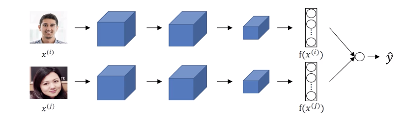
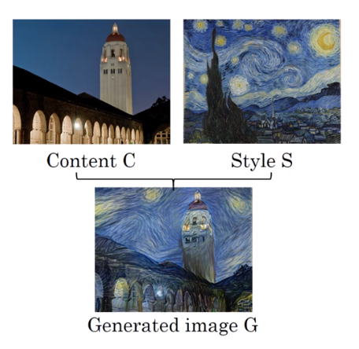
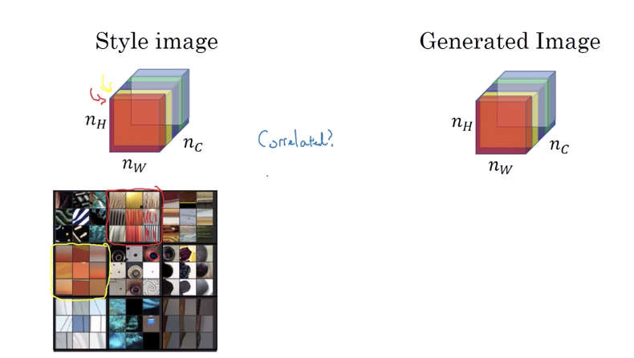

[TOC]

# Face recognition

Face verification:

- Input image, name/ID
- Output whether the input image is that of the claimed person

Recognition

- Has a database of k persons
- Get input image
- Output IF if the image is any of the K persons(or not recognized)

## One shot learning

For most recognition application you need to be able to recognize a person given just one single image, or gicen just one example of that person's face.

Conventional NN usually not work well when we only have 1 sample for each class.

What we uses for face verification is learn a similarity function:

- Let d(img1, img2) the degree of difference between images
  - If $d(img1, img2)\le \tau$, the 2 images are same
  - If $d(img1, img2)>\tau$, the 2 images are different

For face recognition:

Gicen new picture, compare it to all the database and figure out the image that is similar to the new one.

## Siamese Network

Given to images, $x^{(i)}, x^{(j)}$, after convolution, it outputs fully connected layer  $f(x^{(i)}), f(x^{(j)})$. 

The goal of learning is:

- if $x^{(i)}, x^{(j)}$ are the same person, then $||f(x^{(i)})-f(x^{(i)})||^2$ is small.
- if $x^{(i)}, x^{(j)}$ are the different person, then $||f(x^{(i)})-f(x^{(i)})||^2$ is large.

## Triplet loss

Look at an anchor image, we want the distance to be small when the image is similar to anchor and large when are different.

Let A be the anchor image, P a positive image and N is a negative image

we want 
$$
||f(A)-f(P)||^2 +\alpha \le||f(A))-f((P))||^2
$$
By preventing the trivial solution(equal to 0), we put an margin

The loss function is defined as
$$
L(A,P,N)=max(||f(A)-f(P)||^2 +\alpha -||f(A))-f((P))||^2,0)
$$
and the cost function is defined as 
$$
J = \sum_{i=1}^mL(A^{(i)}, P^{(i)},N^{(i)})
$$
**Choosing A, P, N**

- During training, if A, P, N are chose randomly, $d(A,P)+\alpha \le d(A,N)$ is easily satisfied.
- So we have to choose triplet tha're "hard" to train on $d(A,P) \approx d(A,N)$ 

Once defined A, P, N, try to minimize J.

## Face verification and binary classification

Compute the siamese network, then compute the difference
$$
\hat{y} = \sigma \left(\sum_{i=1}^{128} w_i |f(x^{(1)})-f(x^{(2)})|+b\right)
$$

# Neural style transfer

**Cost function**: 
$$
J(G)= \alpha J_{content}(C,G) + \beta J_{style}(S,G)
$$

Find the generated image G:

1. Initialize G randomly
2. Use gradient descent to minimize J(G)
3. $G = G-\frac{\partial J(G)}{\partial G}$

**Content cost function**

- Say you use hidden layer $l$ to compute content cost(l usually in the middle of the network)

- Use pre-trained convNet

- Let $a^{[l](C)}$ and $a^{[l](G)}$ be activation of layer $l$ on the images

- If  $a^{[l](C)}$ and $a^{[l](G)}$ are similar, both images have similar content, then
  $$
  J_{content}(C,G)= \frac{1}{2} ||a^{[l](C)}-a^{[l](G)}||^2
  $$
  will be low.

**Style cost function**

- Say you are using layer $l$ 's activation to measure "style"
- Define style as correlation between activations across channels

- How correlated are the activations across different channels?

  - In this example, we compare the red channel with the yellow channel, if they are correlated, when the yellow channel have vertical lines, the yellow channel has high probability to output orange color. They are uncorrelated if red channel has vertical line but yellow channel don't show orange color.

- We do this comparison in the generated image by computing style matrix.

- Let $a_{i, j, k}^{[l]}$ = activation at (i,j,k). $G^{[l]}$ is $n_c^{[l]}*n_c^{[l]}$ where i represents height, j width and k channels.
  $$
  \begin{aligned}
  G_{k,k'}^{[l](S)}=\sum_{i=1}^{n_H^{[l]}}\sum_{j=1}^{n_W^{[l]}} a_{i, j, k}^{[l](S)}a_{i, j, k'}^{[l](S)}\\
  G_{k,k'}^{[l](G)}=\sum_{i=1}^{n_H^{[l]}}\sum_{j=1}^{n_W^{[l]}} a_{i, j, k}^{[l](G)}a_{i, j, k'}^{[l](G)}
  \end{aligned}
  $$
  Then the cost style is defined as
  $$
  J^{[l]}_{style}(S, G) = \frac{1}{(2n^{[l]}_Hn^{[l]}_Wn^{[l]}_C)^2} \sum_k \sum_{k'}(G^{[l](S)}_{kk'} - G^{[l](G)}_{kk'})^2
  $$
  

When we use more layer the output sytyle will be more sumilar
$$
J_{style}(S, G) = \sum_l \lambda^{[l]} J^{[l]}_{style}(S, G)
$$

## 1D and 3D generalization

