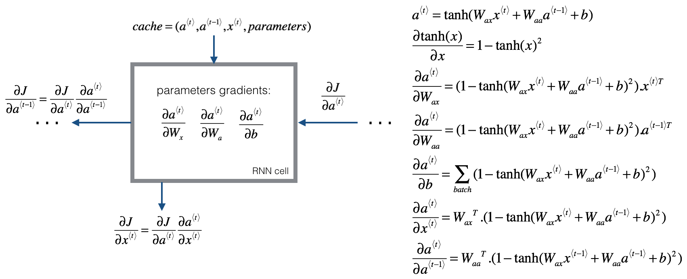
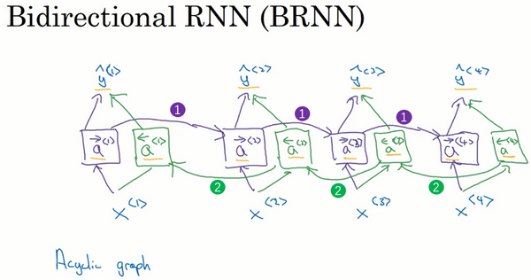

[TOC]

# Recurrent neural networks

**Why RNN**?

There are a lot of sequential data, to understand it, we need the information from previous time steps. In other words, humans don't start theri thinking every time from scratch, but based on the previous information.

**Examples of sequential data in application**:

- Speech recognition

- music generation, 
- Sentiment classification, 
- DNA sequence analysis, 
- Machine translation, 
- Video activity recognition, 
- Name entity recognition: 
  - X: "Harry Potter and Hermoine Granger invented a new spell."
  - Y: 1 1 0 1 1 0 0 0 0 where 1 means it's a name and 0 not a name

There are some problems when we try to use a traditional network for sequencial data: 

- Inputs, outputs can be different lengths in different examples(for exmaple in sentiment classification, the input can be a sentence, but the output can be a number between 1-5)
- The traditional network does't share features learned across different position of text
  - For example if the network have learned in some position that "Harry" is a name, it would be nice that a name appeared in other position can also be recognized. 
  - It usually have some dependency, for example the verb form depending if the subject is singular or plural.

**Notation**

- Superscript $[l]$ denotes an object associated with the $l^{th}$ layer. 
    - Example: $a^{[4]}$ is the $4^{th}$ layer activation. $W^{[5]}$ and $b^{[5]}$ are the $5^{th}$ layer parameters.
- Superscript $(i)$ denotes an object associated with the $i^{th}$ example. 
    - Example: $x^{(i)}$ is the $i^{th}$ training example input.
- Superscript $\langle t \rangle$ denotes an object at the $t^{th}$ time-step. 
    - Example: $x^{\langle t \rangle}$ is the input x at the $t^{th}$ time-step. $x^{(i)\langle t \rangle}$ is the input at the $t^{th}$ timestep of example $i$.
- Lowerscript $i$ denotes the $i^{th}$ entry of a vector.
    - Example: $a^{[l]}_i$ denotes the $i^{th}$ entry of the activations in layer $l$.
- $T_x$ is the length of the input X
- $T_y$ is the length of the output Y

**NLP**

In natural lenguage processing, we have to build a diccionary to represent words.

For modern application the diccionary size is normally between 30000 an 50000 words, but some large companies uses even bigger dictionarys. A diccionaty looks like:

- [a ... And ... Harry ... Potter ... Zulu]

Then we create one hot encoding for each word. 

In addiction, we add `<UNK>` for words that can't be found in our diccionary and `<EOS>` to represent end of sentence.

## Recurrent neural network model

RNN model try to address the shortcome of the traditional network by adding the activation of the previous layer: It recieve input `X` and the activation of the previous layer`a^<t-1>​`, then produces an output `y` and `a`.


In some research papers it is represented by a more compact diagram, in which the  recurrent net is draw as a loop.


For example, given an sentence "Harry Potter is a boy"and we have to predict the output . If we read the sentence from lect to right, the activation $a^{<0>}$ is 0, then when the first word $x^{<1>}$  is given, it will predict which word is -> $y^{<1>}$ , for the next word $x^{<2>}$, instead of predicting $y^{<2>}$ only using $x^{<2>}$, it takes into account which word is the previous one, in this case, knowing the first word is Harry, it will give better prediction for Potter.

As we can observe in the diagram, one weakness of the RNN is that it only uses the previous information, but the following.

The parameters that govern the connection from $X^{<1>}$ to the hidden layer is $W_{ax}$ and the same $W_{ax}$ is used at every time.

### Forward propagation

RNN is composed by RNN cells, which  can be represent as:


RNN takes as input $x^{\langle t \rangle}$ (current input) and $a^{\langle t - 1\rangle}$ (previous hidden state containing information from the past), and outputs $a^{\langle t \rangle}$ which is given to the next RNN cell and also used to predict $y^{\langle t \rangle}$ 
$$
\begin{array}{ccl}
a^{<0>} & = & \vec{0} \\
a^{⟨t⟩} & = & g_1(W_{aa}a^{⟨t-1⟩} + W_{ax}x^{⟨t⟩} + b_a)\\
\hat y^{⟨t⟩} &=& g_2(W_{ya}a^{⟨t⟩} + b_y)\\
\end{array}
$$
Notice that the notation $ W_{ax}$ means that it multiplys $ x $ to compute a, and similaly, $ W_{ya}$ means it multiplys $a$ to compute $y$. 

- `tanh` is common used for activation (`relu` is also used)

- for the output, the activation function depends on the types of output, for example `sigmoid`

- It can also be writen as 
  $$
  a^{<t>} =g\left( W_a[a^{<t-1>}, x^{<t>}]+b_a \right)
  $$
  

  ​	where $W_a=[W_{aa} | W_{ax}]$ and $[a^{<t-1>}, x^{<t>}]=\begin{bmatrix} a^{<t-1>} \\ x^{<t>}\end{bmatrix}$

- and the output can be writen as $\hat y^{⟨t⟩} = g(W_{y}a^{⟨t⟩} + b_y)$


**Shapes**:

- $x^{<t>}$: input data at timestep "t",  (n_x, m).
- $a_{prev}$: Hidden state at timestep "t-1", (n_a, m)
- $W_{ax}$: Weight matrix multiplying the input,  (n_a, n_x)
- $W_{aa}$: Weight matrix multiplying the hidden state, (n_a, n_a)
- $W_{ya}$: Weight matrix relating the hidden-state to the output, (n_y, n_a)
-  $b_a$: Bias,  (n_a, 1)
- $b_y$:  Bias relating the hidden-state to the output, (n_y, 1)
- $a_{next}$ : next hidden state, of shape (n_a, m)
- $y^{<t>}_{pred}$:  prediction at timestep "t", numpy array of shape (n_y, m)

### Backward propagation



Cross entropy loss function for each step:
$$
L^{<t>}(\hat{y}^{<t>}, y^{<t>}) = -y^{<t>} \log \hat{y}^{<t>} - (1-y^{<t>}) \log(1-\hat{y}^{<t>})
$$
Overall loss:
$$
J = L(\hat y, y) = \sum^{T_y}_{t=1} L^{⟨t⟩}(\hat y^{⟨t⟩}, y^{⟨t⟩})
$$
It is also called **Backpropagation throught time**

For a simple unit,
$$
\begin{array}{rcl}
a^{⟨t⟩} & = & tanh(W_{aa}a^{⟨t-1⟩} + W_{ax}x^{⟨t⟩} + b_a)\\
\end{array}
$$
 where $\frac{\partial J}{\partial a}=da_{next}$, if $z^{<t>}  =  W_{aa}a^{<t-1>}+W_{ax}x^{⟨t⟩} + b_a\\$, and $\frac{\partial tanh(x)}{\partial x} = 1- tanh(x)^2$, then
$$
\begin{array}{lllll}
d_{tanh} & = &\frac{\partial a}{\partial z} & = & 1-tanh(z^{<t>})^2 \\
\frac{\partial J}{\partial z} & = & \frac{\partial J}{\partial a} \frac{\partial a}{\partial z} & = & da_{next}*\left( 1-tanh(z^{<t>})^2\right)\\
\frac{\partial a}{\partial Waa} & = & \frac{\partial a}{\partial z}\frac{\partial z}{\partial Waa} & = & \left(1-tanh(z)^2\right) * a^{<t>}\\
\frac{\partial a}{\partial a^{<t-1>}} & = & \frac{\partial a}{\partial z}\frac{\partial z}{\partial a^{<t-1>}} & = & \left(1-tanh(z)^2\right) * W_{aa}\\
\frac{\partial a}{\partial Wax} & = & \frac{\partial a}{\partial z}\frac{\partial z}{\partial Wax} & = & \left(1-tanh(z)^2\right) * x^{<t>}\\
\frac{\partial a}{\partial x^{<t>}} & = & \frac{\partial a}{\partial z}\frac{\partial z}{\partial Wax} & = & \left(1-tanh(z)^2\right) * W_{ax}\\
\frac{\partial a}{\partial z} & = & \frac{\partial a}{\partial z}\frac{\partial z}{\partial b} & = & \sum_{batch}\left(1-tanh(z)^2\right)\\
\end{array}
$$


## Different types of RNNs

Until now we have see examples in which $T_x=T_y$, but in some cases $ T_x$ and $T_y$ are not equal:

- In sentimental classification, the input may be a sentense but the output is number between 1-5 ->many to one
- In machine translation, the input sentense and the output sentense  may not have the same length -> many to many
- Music generation, we can input the first note and it have to generate the output melody -> one to many


From left to right

- One to one: for example image classification
- One to many: image caption, input an image and output a sentence
- Many to one: sentimental classification
- Many to many: machine translation
- Many to many: video classification where we wish to label each frame of the video)

# Language model and sequence generation

**What is language modelling**

The basic job of a language model is given a sequence of word, predict the probability. 

For example, in a sppeach recognition problem someone says that:

- The apple and **pair** salad
- The apple and **pear** salad

pair and pear sounds exactly the same, but the lenguage model should give the probability of those 2 words basing in other informations.

**Buiding the model**

Training set: large corpus of english text:

1. Tockenize the sentense: given a sentense, one not encode it to your dictionary :	

   - The Egyptian Mau is a bread of cat `<EOS>` -> $y^{<1>}, y^{<2>}….y^{<9>}$ 
   - We add `<EOS>` to indicate end of sentence.
   - When the workd is not in the dictionary, for example `Mau`, it will be encoded as `<UNK>` which means unknown 

2. Then the model try to figure out what is the word: for the sentence "Cats average 15 hours of sleep a day \<EOS\>" 

   

   1. At time 1, $a^{<0>}=0, x^{<1>}=\vec{0}$, what the model do is predict the probability all the words in the diccionary , is the first word `a`, `aron`, `cats`?. As the first word is cat, Pr(cat)​ will be largest. 
   2. Then, it try to figure out the second word knowing the first word is `cat`, Pr( \_ /cats)​
   3. The next one is to predict Pr(\_ /"cats average")
   4. And so on until fin `<EOS>`
   
3. The loss function is defined as 
   $$
   \begin{array}{lcl}
   \mathcal{L}\left(\hat{y}^{<t>}, y^{<t>}\right) & = &-\sum_{i} y_{i}^{<t>} \log \hat{y}_{i}^{<t>}\\
   \mathcal{L}& = & \sum_{t} \mathcal{L}^{<t>}\left(\hat{y}^{<t>}, y^{<t>}\right)
   \end{array}
   $$
   

## Sample novel sequences


After a sequence model is trained on a language model, to check what the model has learn we can apply to sample novel sequence. 

Given the model:

1. Input $a^{<0>}=\vec{0}, x^{<1>}=\vec{0}$ . Notice that x's shape is (dict_size,1) because it will be one hot encoded to the dict. a's shape is(n_a, 1)

2. Run forward propagation to get $a^{<t>}$ and $y^{<t>}$. Note that $y^{<t>}_i$ represents the probability that the character indexed by `i` is the next character.

3. **Randomly chose**  the next character's index according to the probability distribution specified by  $y^{<t>}$ . This means that if $y^{<t>}_i=0.16$, you will pick the index `i` with 16% of probability. 

   ```python
   np.random.seed(0)
   p = np.array([0.1, 0.0, 0.7, 0.2])
   index = np.random.choice([0, 1, 2, 3], p = p.ravel())
   ```

   This means that you will pick the `index` according to the distribution: 
   $P(index = 0) = 0.1, P(index = 1) = 0.0, P(index = 2) = 0.7, P(index = 3) = 0.2$

4. Use the last predicted word as the input and the activation to compute the next word. 

5. Keep sampling until we got `<EOS>` or a fixed length.

we can reject `<UNK>` or keep it in the output

If is character level, the output will be [a-z, A-Z. 0-9]

## Vanishing gradients with RNN

In standard neural network we have see the gradient vanishing and gradient exploding problem. A RNN is usually a large network: an RNN that process a sequence data with the size 100000 time steps has 10000 layers, which is very hard to optimize. 

When the relationship that it need are close, it is easier for RNN to learn, for example "the clouds are in the *sky*,”  clouds and sky are quire close. 

However, there are some more complicate situations: For example:

- "The **cat**, which already ate ..., **was** full"
- "The **cats**, which already ate ..., **were** full"

For RNN is quite difficult to capture the long term dependencies like that.  As there are a lot of things in the middle, then is difficult to correct the mistake of "was/were".

To resolve the gradient vanishing one can uses following techniques:

- Weight initialization
- Use LSTM/GRU networks

**Exploding gradient**

RNN has gradient exploling problem, which can be catastrophic. Gradient expliding can be easily seen when your weight values become `nan`. It can be resulve by gradient clipping: rescale so the gradient vector it not too big.

There are different ways to clip gradients, one of them is to clip each element to [-N, N]


We can use numpy.clip:

```python
np.clip(a, a_min, a_max, out)# For in-place clipping, specify out.
```

## Gated recurrent unit (GRU)

Is a modification of RNN hidden layer that captures better long range connections and helps with the vanishing gradient problem.

GRU has a memory cell, which's role is to memorize, in the example of cat, memorize the cat is singular or plural.

- At time t, the memory cell will have value $c^{<t>}$
- The GRU unit will output an activation value that's equal to  $c^{<t>}$:  $a^{⟨t⟩}  =  c^{⟨t⟩}$, so they have the same shape.
- At each time step, we overwrite the memory cell with $\tilde c^{⟨t⟩}$ so this will be a candidate to replace $c^{<t>}$

$$
\tilde c^{⟨t⟩}  =  tanh(W_c[c^{⟨t-1⟩}, x^{⟨t⟩}] + b_c)
$$

- The gate $\Gamma_u$ is ranged between 0 and 1 and u means update. The gate decide if we update $c^{<t>}$ 

$$
\Gamma_u  =  \sigma(W_u[c^{⟨t-1⟩}, x^{⟨t⟩}] + b_u)
$$

- Then, we will replace $c^{⟨t⟩}$ depending on the value of gate. If gate=0, then remain the previous value, otherwise replace by $\tilde c^{⟨t⟩}$
  $$
  c^{⟨t⟩}  =  \Gamma_u \times \tilde c^{⟨t⟩} + (1 - \Gamma_u) \times c^{⟨t-1⟩}
  $$
  

Suppose that C is 0 or 1 depending on whether the subject of the sentence is singular or plular, if is singular it is set to 1, else 0.

GRU unit would memorize the value of  $c^{<t>}$  until find the word was.

As $\Gamma$ can be easiely maintained closed to 0, $c^{<t>} \approx c^{<t-1>}$ 

**Full GRU**
$$
\begin{array}{ccl}
\tilde c^{⟨t⟩} & = & tanh(W_c[ \Gamma_r *c^{⟨t-1⟩}, x^{⟨t⟩}] + b_c) \\
\Gamma_u  & = & \sigma(W_u[c^{⟨t-1⟩}, x^{⟨t⟩}] + b_u)\\
\Gamma_r  & = & \sigma(W_r[c^{⟨t-1⟩}, x^{⟨t⟩}] + b_r)\\
c^{⟨t⟩}  & = & \Gamma_u \times \tilde c^{⟨t⟩} + (1 - \Gamma_u) \times c^{⟨t-1⟩}
\end{array}
$$

- where $\Gamma_r$ represents the relevance gate, how relevante is  $ c^{⟨t-1⟩}$

## Long short term memory LSTM


LSTM is a more powerful and general version of GRU. 

1. Decide what information we're going to throw away from cell state, decision made by **forget gate**. $\Gamma_f$ is a sigmoid function, so it is ranged between 0 and 1.  If  $\Gamma_f^{\langle t \rangle} \approx 0$ is 0 then the LSTM should forget that piece of information (e.g. the singular subject) in the corresponding component of $c^{\langle t-1 \rangle}$. If $\Gamma_f^{\langle t \rangle} \approx 1$ then it will keep the information. 

- $$
  \Gamma_f^{\langle t \rangle} = \sigma(W_f[a^{\langle t-1 \rangle}, x^{\langle t \rangle}] + b_f)
  $$
  
  For example, in a language model when trying to predict the next word based on the previous ones.  In such a problem, the cell state might include that if the present subject is singular or plural. Once new subject are found ( for example a plural subject), we want forget the old subject.
  
- The next step is to decide what new information we are going to store in the cell state. This has 2 parts: 
  
  - **Update gate**: this is a sigmoid layer which decides which values we will update. 
    $$
    \Gamma_u^{\langle t \rangle} = \sigma(W_u[a^{\langle t-1 \rangle}, x^{\{t\}}] + b_u)
  $$
    Once we forget that the subject being discussed is singular, we need to find a way to update it to reflect that the new subject is now plural.
  
  - **Updating cells** the candidate for replace the previous cell is $\tilde{c}$. When update gate is open(update gate=1), then compute the cell state $c^{\langle t \rangle}$ by taking elemnet wise multiplication with $\Gamma_u^{\langle t \rangle}$
  $$
  \tilde{c}^{\langle t \rangle} = \tanh(W_c[a^{\langle t-1 \rangle}, x^{\langle t \rangle}] + b_c) \\
  $$
  The new $c^{\langle t \rangle}$ is the sum of what wasn't be forgot + what is updated.
  $$
  c^{\langle t \rangle} = \Gamma_f^{\langle t \rangle}* c^{\langle t-1 \rangle} + \Gamma_u^{\langle t \rangle} *\tilde{c}^{\langle t \rangle}
  $$
  
- After that, we need to decide what we are going to output. This output will be based on our cell state, but will be a filtered version. 
  
  - First, we run a sigmoid layer which decides what parts of the cell state we’re going to output, decided by **output gate**
    $$
    \Gamma_o^{\langle t \rangle}=  \sigma(W_o[a^{\langle t-1 \rangle}, x^{\langle t \rangle}] + b_o) \\
    $$
    
  - Then, we put the cell state through tanh (to push the values to be between −1 and 1) and multiply it by the **output gate**, so that we only output the parts we decided to.
  
  $$
  a^{\langle t \rangle} = \Gamma_o^{\langle t \rangle}* \tanh(c^{\langle t \rangle})
  $$
  
- Finally, the output:
  $$
  y^{<t>}=\sigma(W_y*a^{<t>}+b_y)
  $$
  

**Shapes**

When we use LSTM in a RNN:

- x's shape = $(m, T_x, n_{values})$ where $n_{values}$ is the unique values in the dataset
-  $a^{<0>}=\vec{0}$ , a's shape is(n_a, 1)
- $c^{<0>}$'s shape = $a^{<0>}$'s shape

## Back propagation

$$d \Gamma_o^{\langle t \rangle} = da_{next}*\tanh(c_{next}) * \Gamma_o^{\langle t \rangle}*(1-\Gamma_o^{\langle t \rangle})\tag{7}$$

$$d\tilde c^{\langle t \rangle} = dc_{next}*\Gamma_u^{\langle t \rangle}+ \Gamma_o^{\langle t \rangle} (1-\tanh(c_{next})^2) * i_t * da_{next} * \tilde c^{\langle t \rangle} * (1-\tanh(\tilde c)^2) \tag{8}$$

$$d\Gamma_u^{\langle t \rangle} = dc_{next}*\tilde c^{\langle t \rangle} + \Gamma_o^{\langle t \rangle} (1-\tanh(c_{next})^2) * \tilde c^{\langle t \rangle} * da_{next}*\Gamma_u^{\langle t \rangle}*(1-\Gamma_u^{\langle t \rangle})\tag{9}$$

$$d\Gamma_f^{\langle t \rangle} = dc_{next}*\tilde c_{prev} + \Gamma_o^{\langle t \rangle} (1-\tanh(c_{next})^2) * c_{prev} * da_{next}*\Gamma_f^{\langle t \rangle}*(1-\Gamma_f^{\langle t \rangle})\tag{10}$$

### 3.2.3 parameter derivatives 

$$ dW_f = d\Gamma_f^{\langle t \rangle} * \begin{pmatrix} a_{prev} \\ x_t\end{pmatrix}^T \tag{11} $$
$$ dW_u = d\Gamma_u^{\langle t \rangle} * \begin{pmatrix} a_{prev} \\ x_t\end{pmatrix}^T \tag{12} $$
$$ dW_c = d\tilde c^{\langle t \rangle} * \begin{pmatrix} a_{prev} \\ x_t\end{pmatrix}^T \tag{13} $$
$$ dW_o = d\Gamma_o^{\langle t \rangle} * \begin{pmatrix} a_{prev} \\ x_t\end{pmatrix}^T \tag{14}$$


# Bidirectional RNN

As previously commented that RNN only learns from previous information, bidirectional RNN is made to learn also from next informations.

For example:

- He said, "Teddy bears are on sale"
- He said, "Teddy Roosevelt was a great president"

In this case, only knowing the previous information we don't know if teddy referes to bear of the president, but with the following information there are no doubt.



Note that BRNN is **acyclic graphic**, it learns from both sides. 

For a lot of NLP or text processing problems, a BRNN with LSTM are commonly used.

The disadvantage of BRNN that you need the entire sequence before you can process it

# Deep RNN

In a lot of applications one layer RNN will solve your problem, but in some cases it is useful to use deep RNNs.

A 3 layers RNN looks like


3 layer is a lot for RNN due to the time dimension.

---

Further reading

https://colah.github.io/posts/2015-08-Understanding-LSTMs/

http://karpathy.github.io/2015/05/21/rnn-effectiveness/