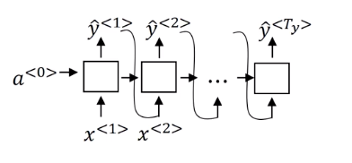
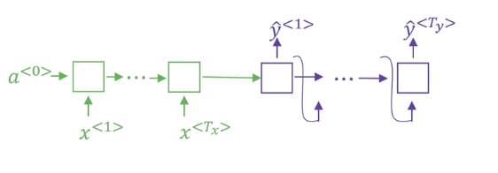
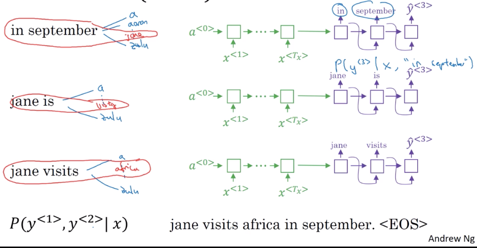
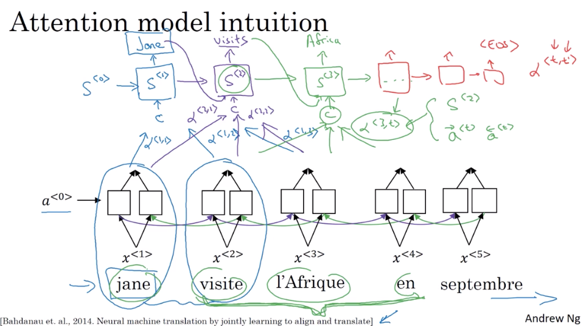
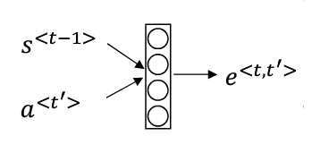
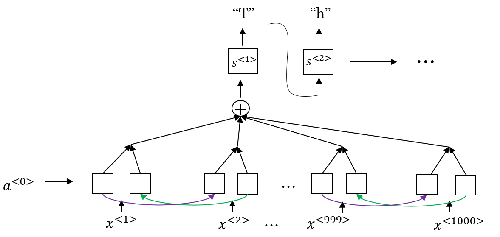
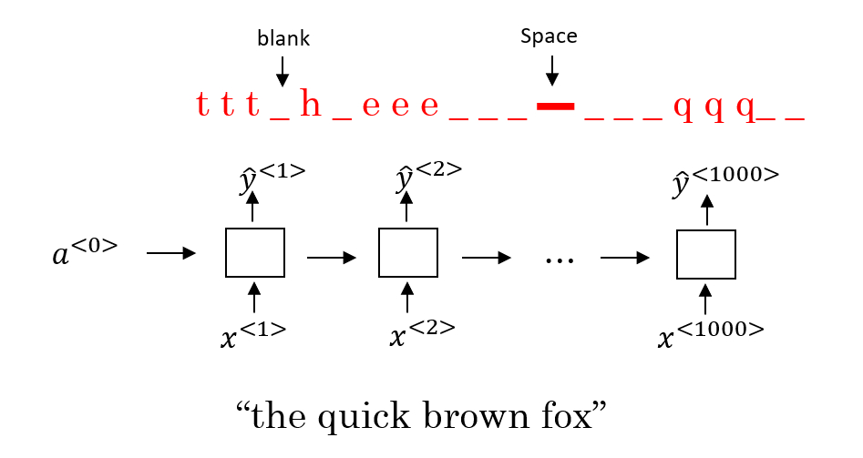
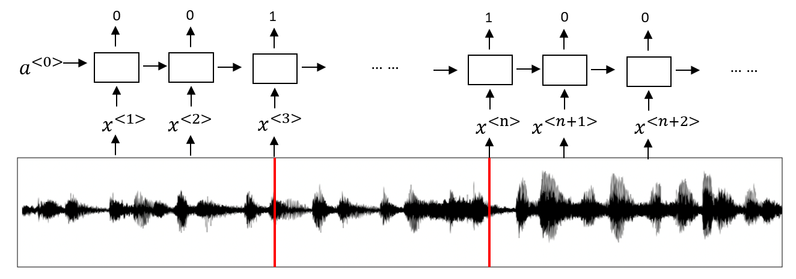

[TOC]

# Various sequence to sequence architectures

## Basic models

Example of machine translation:

- Jane visite l'Afrique en septembre: $x^{<1>}, ...x^{<5>}$
- Jane is visiting Africa in September: $y^{<1>}, …y^{<6>}$

Encoding model + decoding model

Example image captioning:

- From image output a sentence

## Picking the most likely sentence

**Machine translation as buiding a conditional language model**

|                 Language model                  |                    Machine translation                    |
| :---------------------------------------------: | :-------------------------------------------------------: |
|  |  |

Notice that the decoder is similar to the language model except that instead of start with vector of zeros, it has an encoder network that create input.

The probability is conditional:
$$
Pr(y^{<1>}, ...y^{<T_y>}|x^{<1>}, ...x^{<T_x>})
$$
The model tell you what is the probability difference in correspinding English translation

You don't have to sample, what you want is 
$$
\mathop{\arg \max}_{y^{<1>}, ...y^{<T_y>}} Pr(y^{<1>}, ...y^{<T_y>}|x^{<1>}, ...x^{<T_x>})
$$
**Greedy search**

- Pick the most likely first word: $Pr(\hat{y}^{<1>}|x)$
-  Pich the second word that is most likely and so on 

However, it may not work, for example, it may gives:

- Jane is visiting Africa in September
- Jane is going to be visiting Africa in September

As Pr(Jane is going|x) > Pr(Jane is visiting|x), it may pick the second sentence, but it is not a good translation.

Beam serach algotithm try to search a better solution

## Beam search

Set beam width: how many word to pick. In the example we pick 2

Jane is visiting Africa in September

For this sentence, 

1. Pick the first word of the English translation: in, jane, september
2. For each of those 3 words, pass trough encoder, generating the possible second word. To evaluate, use the decoder to decide which word pick: 
   1. $Pr(\hat{y}^{<1>}, \hat{y}^{<2>}|x) = Pr(\hat{y}^{<1>}|x)|Pr(\hat{y}^{<1>},x)$ 
   2. The most likely is:
      1. In september
      2. jane is
      3. jane visits
3. Then compute the next one and so on

We evaluate 10000x3 possibilities but we kept 3 beams

Finally, 
$$
\mathop{\arg \max}_{y^{<1>}, ...y^{<T_y>}} \prod_{t=1}^{T_y} Pr(y^{<1>}, ...y^{<T_y>}|x^{<1>}, ...x^{<T_x>})
$$

If beam = 1, then it is greedy search

## Refinements to beam search

**Length normalization**

The original beam search predict basing the probability of the previous, so it may be tiny because we are multiplying numbers less than 1(which is called numerical underflow). Instead of using that, we can use log to normalize:
$$
\mathop{\arg \max}_{y^{<1>}, ...y^{<T_y>}} \frac{1}{T_y^{\alpha}}\sum_{t=1}^{T_y} \log Pr(y^{<1>}, ...y^{<T_y>}|x^{<1>}, ...x^{<T_x>})
$$
where $\alpha$ is a hyperparameters to punish long sentece. 

Looking at the original, as we are multiplying, when more terms are used, smaller is the probability. By dividing by $\frac{1}{T_y}$, it reduces the punishment.

If $\alpha = 0$, you are not normalizing, if $\alpha=1$: complete normalization.

**How to chose B**:

- Large B: more possibilities, better result, slower,
- Small B: worse result, faster.

In production system: B  between 10-100

In research system: B between 1000-3000

## Error analysis in beam search

The model has 2 parts: RNN(encoder + decoder) and beam search algorithm.

First, try to find which part cause error.

Given an example

- Human: Jane visits Africa in September. ($Pr(y^*|x)$)

- Algorithm: Jane visited Africa last September. ($Pr(\hat y|x)$)

There are 3 cases:

1. $Pr(y^*|x)>Pr(\hat y|x)$: beam search chose $\hat y$ but $y^*$ attains higher $Pr(\hat y|x)$-> beam search is fault
2. $Pr(y^*|x) \le Pr(\hat y|x)$: $y^*$ is a better translation than $\hat y$, but RNN predicted ($Pr(y^*|x) \le Pr(\hat y|x)$) -> RNN model is at fault

# Bleu score

What happen if there are sentences with same probabilities?

Example:

- French: Le chat est sur le tapis
- Human1: The cat is on the mat
- Human: There is a cat on the mat
- Machine translation: the the the the the the

Bleu: bilingual evaluation understudy: compare the sentence generater by the machine and human, when closer to human's translation, the higher is the score.

The precision can be computes as maximum number of times that appears in the human transtaled sentence divided by the number of times that appears in the machine translated sentence, in this case: 2/7.

**Bleu score on bigrams**

- Human1: The cat is on the mat
- Human: There is a cat on the mat
- Machine translation: the cat the cat on the mat

|   Pairs    | Count | Count clip |
| :--------: | :---: | :--------: |
|  the cat   |   2   |   1 (Y1)   |
|  cat the   |   1   |     0      |
|   cat on   |   1   |   1 (Y2)   |
|   on the   |   1   |   1 (Y1)   |
|  the mat   |   1   |   1 (Y1)   |
| **Totals** |   6   |     4      |

Extract all combinations by 2 words in the correct order, count the number that it appears in the sentence, if it is found in human sentence, clips the count. Finnaly, count = 6 and count clip = 4 in this case, then the blue score is 4/6

**n-gram**

By the same logic, for n gram:
$$
p_n = \frac{\sum_{\text{n-gram} \in \hat y}count_{clip}(\text{n-gram})}{\sum_{\text{n-gram} \in \hat y}count(\text{n-gram})}
$$
If p1=p2=1, so you can pick whichever.

**Bleu detailes**

- $P_n$ = bleu score on one tyoe if n-gram

  

- **BP** is called **BP penalty** which stands for brevity penalty. It turns out that if a machine outputs a small number of words it will get a better score so we need to handle that.
  $$
  BP = 
  \begin{cases} 
  1, &MT\_length \ge BM\_length \\ 
  exp(1 - \frac{MT\_length}{BM\_length}), &MT\_length \lt BM\_length 
  \end{cases}
  $$

  - It will be penalized if the given sentence is too short ( less than best match lengths)

- Finally 
  $$
  Blue = BP \times exp(\frac{1}{N}\sum^N_{i=1} {p_n})
  $$

  - We can also use log is used for length normalization.

This is not used for speach recognition.

## Attention model

When we have large sentences, human by translate by part,  machine translation works with similar model: when sentence si short, the bleu score is low, when it increases, the blue score also increases, however, when it is too large, the bleu score decrease.

It defines a windows size in which we pay attention to the original language word.

There is a attention weight: amount of attention that $y^{<t>}$ should pay to $a^{<t'>}$
$$
a^{\langle t’ \rangle} = ({\overrightarrow a}^{\langle t’ \rangle}, {\overleftarrow a}^{\langle t’ \rangle})
$$
where $\overrightarrow a$ represents forward propagation and $\overleftarrow a$ backward. $\sum_{t'} \alpha = 1$. The context is defined as 
$$
context^{<t>} = \sum_{t' = 1}^{T_x} \alpha^{<t,t'>}a^{<t'>}
$$
**Computing attention**

We use softmax to ensure $\sum_{t'}\alpha = 1$
$$
\alpha^{\langle t,t’ \rangle} = \frac{exp(e^{\langle t,t’ \rangle})}{\sum^{T_x}_{t'=1}exp(e^{\langle t,t’ \rangle})}
$$

# Speech recognition: audio data

## Speech recognition

Problem: given an audio clip, generate an transcript

- Audio data is converted as spectrogram, and use it as input or the neural network. ( A spectrogram is computed by sliding a window over the raw audio signal, and calculates the most active frequencies in each window using a Fourier transform)

- Research papers have around 300 - 3000 hours of training data while the best commercial systems are now trained on over 100,000 hours of audio.
- The speech recognition system can be build using attention model.

**CTC cost for speech recognition**

Connectionist temporal classification

for example "The quick brown fox":

- Using the RNN as we described above, it has 1000 inputs, however, not all input has the corresponding output: **Input>output**.
- What CTC do is allow RNN add `<SPC>` and `_`, using space and black, so the output will have the same size.
- Finnaly collapse the repeated words between 2 blanck and remove space to get the correct output.

## Trigger word detection

Set target label.

- One disadvantage ot this is that create a very imbalanced training set. To make it easier, we can output a few ones for several times or fixed period of times before reverting back to zero.